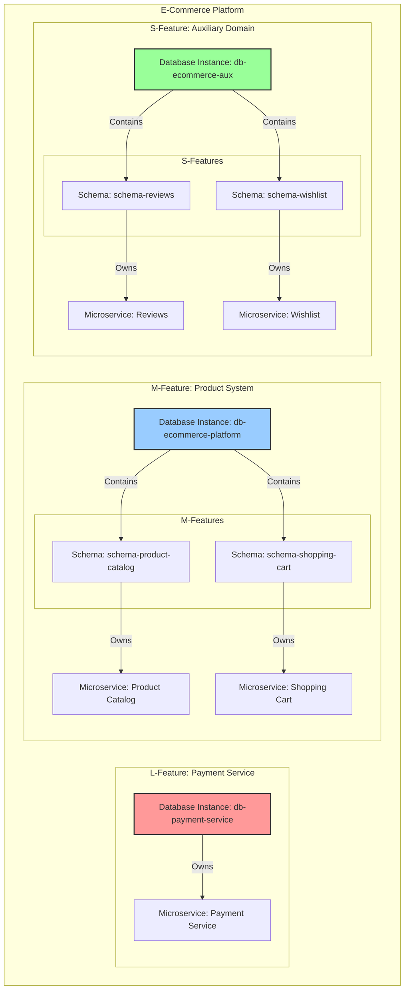

---

## **เอกสารมาตรฐานสถาปัตยกรรม: แนวทางการออกแบบระบบและฐานข้อมูลแบบ Hybrid สำหรับ Microservices**

| **เอกสารเลขที่:** | ARCH-STD-001 | **วันที่:** | 26 ตุลาคม 2023 |
| :--- | :--- | :--- | :--- |
| **ผู้เขียน:** | Senior Database Architect | **สถานะ:** | ฉบับสมบูรณ์ (Final) |
| **ผู้อนุมัติ:** | [ชื่อผู้นำเสนอ] | **วันที่อนุมัติ:** | |

---

### **บทนำ: วิสัยทัศน์และเป้าหมาย (Vision & Goals)**

เอกสารนี้กำหนดมาตรฐานสถาปัตยกรรมสำหรับการพัฒนาระบบใหม่ทั้งหมดขององค์กร โดยมีวิสัยทัศน์ที่จะสร้างระบบที่ **ยืดหยุ่น (Flexible), สามารถขยายตัวได้ (Scalable), พัฒนาได้รวดเร็ว (Fast to Market)** และมี **ต้นทุนที่เหมาะสม (Cost-Effective)**

เราจะบรรลุวิสัยทัศน์นี้ผ่านการนำเสนอ **แนวทางการออกแบบแบบ Hybrid** ที่ผสมผสานหลักการของ Microservices กับการจัดการทรัพยากรแบบมีหลักการ เพื่อสร้างสมดุลระหว่างความเป็นอิสระของแต่ละ Service กับประสิทธิภาพการใช้งานทรัพยากรร่วมกัน

---

### **1. หลักการโครงสร้างระบบ (Architectural Hierarchy)**

เพื่อให้การออกแบบมีความชัดเจนและสอดคล้องกันทั่วทั้งองค์กร เรากำหนดโครงสร้างของระบบออกเป็น 4 ระดับ ดังนี้

#### **1.1 Platform (แพลตฟอร์ม)**
*   **คือ:** กลุ่มของระบบที่ทำงานร่วมกันเพื่อบริการธุรกิจในโดเมนใหญ่ๆ หนึ่งๆ
*   **ตัวอย่าง:** E-Commerce Platform, User Management Platform, Analytics Platform
*   **หน้าที่:** เป็นเสมือน "เมือง" ที่บรรจุระบบต่างๆ ไว้ภายใน

#### **1.2 System (ระบบ)**
*   **คือ:** กลุ่มของความสามารถ (Features) ที่เกี่ยวข้องกันเพื่อทำหน้าที่หนึ่งๆ ภายใน Platform
*   **ตัวอย่าง (ใน E-Commerce Platform):** Product System, Order System, Payment System
*   **หน้าที่:** เป็นเสมือน "เขต" หรือ "ย่าน" ภายในเมือง

#### **1.3 Feature (คุณสมบัติ/ฟีเจอร์)**
*   **คือ:** กลุ่มของฟังก์ชันการทำงานที่มีความสามารถเฉพาะตัวและสามารถส่งมอบคุณค่าได้อย่างอิสระ เทียบได้กับ **Application หรือ Program 1 ตัวที่สมบูรณ์** ซึ่งสามารถทำหน้าที่ได้เป็นอิสระ คล้ายกับ "อาคาร" แต่ละหลังในย่านนั้นๆ
    *   ภายในแต่ละ Feature ประกอบด้วย **UI (Frontend)** และ **Service (Backend)**
*   **ตัวอย่าง (ใน Product System):** Product Catalog, Product Search, Product Reviews
*   **หน้าที่:** เป็นเสมือน "อาคาร" แต่ละหลังในย่านนั้นๆ

#### **1.4 Microservice (ไมโครเซอร์วิส)**
*   **คือ:** **ส่วน Service (Backend) ของ Feature** ซึ่งเป็น **หน่วยที่เล็กที่สุดที่เราสามารถ Deploy ได้ (Smallest Deployment Unit)**
*   หลักการที่สำคัญที่สุด: **`1 Feature = 1 Microservice`**
*   **หน้าที่:** เป็น "ทีมงาน" ที่รับผิดชอบการก่อสร้างและบำรุงรักษาอาคารนั้นๆ อย่างเต็มตัว

> **กฎเหล็ก:** **1 Feature = 1 Application (UI + Service)** และ **1 Service = 1 Microservice**
---

### **2. กลไกการตัดสินใจ: การจำแนกขนาดของ Feature (Feature Sizing: T-Shirt Model)**

การจะกำหนดกลยุทธ์ที่เหมาะสม เราต้องประเมินขนาดและความสำคัญของแต่ละ Feature ก่อนเริ่มพัฒนา โดยใช้โมเดล T-Shirt

| ขนาด | คุณสมบัติ (Characteristics) | ตัวอย่าง |
| :--- | :--- | :--- |
| **Small (S)** | - ผู้ใช้งานน้อย / ไม่ใช่งานหลัก - Workload ต่ำ - ทน Downtime ได้ชั่วคราว | - ระบบแสดงความคิดเห็น (Reviews) - รายการโปรด (Wishlist) |
| **Medium (M)** | - ส่วนหนึ่งของการทำงานหลัก - ผู้ใช้งานสม่ำเสมอ - Workload ปานกลางถึงสูง | - ระบบสินค้าและคลัง (Product Catalog) - ระบบตะกร้าสินค้า (Shopping Cart) |
| **Large (L)** | - **สำคัญที่สุดต่อธุรกิจ** - Concurrent User สูงมาก - Workload สูงมาก - ต้องการ High Availability | - ระบบชำระเงิน (Payment) - ระบบสั่งซื้อหลัก (Order Core) |

---

### **3. การเทียบโครงสร้างกับกลยุทธ์ฐานข้อมูล (Mapping Hierarchy to Database Strategy)**

นี่คือหัวใจของเอกสารฉบับนี้ การเชื่อมโยงโครงสร้างและขนาดของ Feature เข้ากับกลยุทธ์ฐานข้อมูลที่เหมาะสมที่สุด

#### **3.1 หลักการพื้นฐานของฐานข้อมูล**
*   **Database-per-Service (แบบแท้):** Service ละ 1 Database Instance. ให้ความอิสระและประสิทธิภาพสูงสุด แต่ต้นทุนสูง
*   **Database-per-Service (แบบ Logic):** แชร์ Database Instance แต่แยกเขตแดนด้วย Schema. ลดต้นทุนแต่ยังคงความสามารถในการ Isolation ได้ดี

#### **3.2 ตารางการเทียบโครงสร้างกับฐานข้อมูล**

| โครงสร้าง | ขนาด Feature | **กลยุทธ์ฐานข้อมูลที่ใช้** | **ระดับฐานข้อมูล (Database Level)** | ตัวอย่างชื่อฐานข้อมูล |
| :--- | :--- | :--- | :--- | :--- |
| **Platform** | - | - | **Database Instance หลักของ Platform** (สำหรับ M-Feature) | `db-ecommerce-platform` |
| **System** | - | - | **Schema ภายใน Platform DB** (ถ้าต้องการแยกเขตระดับ System) | `schema_product_system` |
| **Feature** | **Large (L)** | **Database per Feature (แบบแท้)** | **Database Instance สำหรับ Feature เดียว** | `db-payment-service` |
| **Feature** | **Medium (M)** | **Database per Platform + Schema per Feature** | **Schema ภายใน Platform DB** | `db-ecommerce-platform` -> `schema-shopping-cart` |
| **Feature** | **Small (S)** | **Database per Domain + Schema per Feature** | **Schema ภายใน Domain DB** | `db-ecommerce-aux` -> `schema-reviews` |

**คำอธิบายเพิ่มเติม:**
*   **L-Feature:** ได้รับการพิจารณาให้มีฐานข้อมูลระดับ **Database Instance** ของตัวเองทันที เพราะความสำคัญและ Workload สูง
*   **M-Feature:** อยู่ในฐานข้อมูลระดับ **Schema** ภายใต้ **Database Instance** ของ Platform ที่ตัวเองสังกัดอยู่
*   **S-Feature:** อยู่ในฐานข้อมูลระดับ **Schema** ภายใต้ **Database Instance** ของ "Domain" ที่เป็นกลุ่มรองรับ (Auxiliary) เพื่อประหยัดต้นทุนและลดความเสี่ยง

---

### **4. แนวทางการปฏิบัติและมาตรฐาน (Implementation Guidelines & Standards)**

#### **4.1 การบังคับใช้ Service Boundary**
*   **ห้าม JOIN ข้าม Feature:** การเชื่อมต่อข้อมูลระหว่าง Feature ต้องทำผ่าน API เท่านั้น
*   **Project Structure:** แต่ละ Feature ต้องมี Project แยกหมด พร้อม `dataAccess` layer ของตัวเอง
*   **Dedicated DB User:** แต่ละ Service ต้องใช้ Database User ของตัวเอง และมีสิทธิ์เฉพาะในเขตแดนที่กำหนด

#### **4.2 การจัดการ Schema และ Table**
*   **ใช้ Prisma `@@map`:** บังคับการตั้งชื่อตารางผ่าน Configuration และ Generator เพื่อลดข้อผิดพลาดจากมนุษย์
*   **ใช้ Liquibase:** ทุกการเปลี่ยนแปลง Schema ต้องผ่าน Migration Script ที่ถูก Version Control

#### **4.3 การเติบโตและการย้ายข้อมูล (Evolution & Migration)**
*   **S -> M:** ย้าย Schema จาก `db-domain-aux` ไปยัง `db-platform`
*   **M -> L:** ย้ายทั้ง Schema ออกไปสู่ Database Instance ใหม่
*   ต้องมี "Migration Playbook" ที่ชัดเจนสำหรับแต่ละกรณี

#### **4.4 การ Monitoring และ Alerting**
*   ต้องมีระบบเฝ้าระวังประสิทธิภาพของ Database ในระดับที่ละเอียด (ต่อ Schema/Feature)
*   ตั้งค่า Alert เพื่อจับสัญญาณที่บ่งบอกว่า Feature กำลังจะโตเกินขนาดที่กำหนด เพื่อเริ่มกระบวนการวางแผน Migration

---

### **5. ภาพรวมแผนภูมิสถาปัตยกรรม (Architectural Overview Map)**

---

### **6. สรุป**

มาตรฐานสถาปัตยกรรมนี้ให้กรอบการทำงานที่ชัดเจนสำหรับการสร้างระบบ Microservices ที่ทันสมัย โดยการผสมผสานกลยุทธ์ฐานข้อมูลหลายระดับเข้าด้วยกัน ทำให้เราสามารถ:
*   **เริ่มต้นได้รวดเร็วและประหยัด** กับ Feature ที่ไม่สำคัญ
*   **ลงทุนทรัพยากรเฉพาะส่วนที่สำคัญ** และต้องการประสิทธิภาพสูง
*   **สร้างระบบที่พร้อมเติบโตและปรับเปลี่ยน** ได้อย่างยืดหยุ่นตามความต้องการของธุรกิจ

การปฏิบัติตามมาตรฐานนี้อย่างเคร่งครัดจะเป็นพื้นฐานสำคัญในการสร้างความสำเร็จให้กับระบบดิจิทัลขององค์กรในระยะยาว