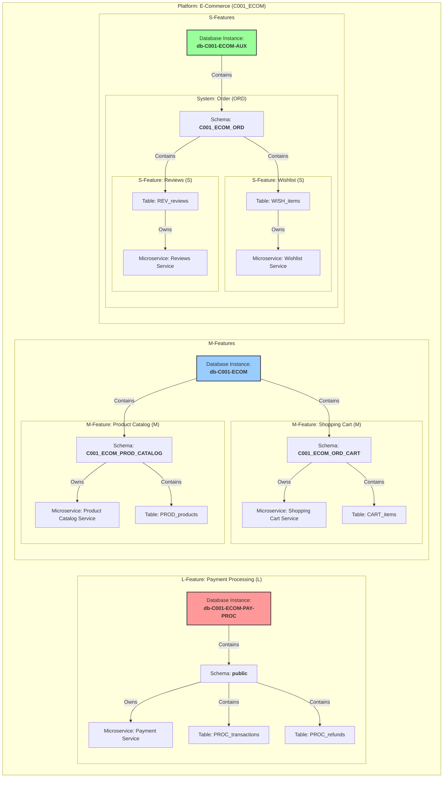
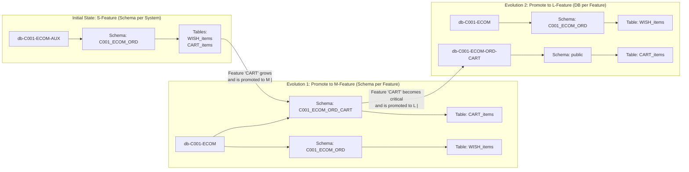

# **เอกสารมาตรฐานสถาปัตยกรรม: แนวทางการออกแบบระบบและฐานข้อมูลแบบ Hybrid สำหรับ Microservices**

| **เอกสารเลขที่:** | ARCH-STD-001 | **วันที่:** | 26 ตุลาคม 2023 |
| :--- | :--- | :--- | :--- |
| **ผู้เขียน:** | Senior Database Architect | **สถานะ:** | ฉบับสมบูรณ์ (Final) |
| **ผู้อนุมัติ:** | [ชื่อผู้นำเสนอ] | **วันที่อนุมัติ:** | |

---


### **บทนำ: วิสัยทัศน์และเป้าหมาย (Vision & Goals)**

เอกสารนี้กำหนดมาตรฐานสถาปัตยกรรมสำหรับการพัฒนาระบบใหม่ทั้งหมดขององค์กร โดยมีวิสัยทัศน์ที่จะสร้างระบบที่ **ยืดหยุ่น (Flexible), สามารถขยายตัวได้ (Scalable), พัฒนาได้รวดเร็ว (Fast to Market)** และมี **ต้นทุนที่เหมาะสม (Cost-Effective)**

เราจะบรรลุวิสัยทัศน์นี้ผ่านการนำเสนอ **แนวทางการออกแบบแบบ Hybrid** ที่ผสมผสานหลักการของ Microservices กับการจัดการทรัพยากรแบบมีหลักการ เพื่อสร้างสมดุลระหว่างความเป็นอิสระของแต่ละ Service กับประสิทธิภาพการใช้งานทรัพยากรร่วมกัน

---


### **1. หลักการโครงสร้างระบบ (Architectural Hierarchy)**

เพื่อให้การออกแบบมีความชัดเจนและสอดคล้องกันทั่วทั้งองค์กร เรากำหนดโครงสร้างของระบบออกเป็น 4 ระดับ ดังนี้

#### **1.1 Platform (แพลตฟอร์ม)**
*   **คือ:** กลุ่มของระบบที่ทำงานร่วมกันเพื่อบริการธุรกิจในโดเมนใหญ่ๆ หนึ่งๆ
*   **ตัวอย่าง:** E-Commerce Platform, User Management Platform, Analytics Platform
*   **หน้าที่:** เป็นเสมือน "เมือง" ที่บรรจุระบบต่างๆ ไว้ภายใน

#### **1.2 System (ระบบ)**
*   **คือ:** กลุ่มของ Modules ที่เกี่ยวข้องกันเพื่อทำหน้าที่หนึ่งๆ ภายใน Platform
*   **ตัวอย่าง (ใน E-Commerce Platform):** Product System, Order System, Payment System
*   **หน้าที่:** เป็นเสมือน "เขต" หรือ "ย่าน" ภายในเมือง

#### **1.3 Module (โมดูล)**
*   **คือ:** การจัดกลุ่ม Features ที่เกี่ยวข้องกันทางตรรกะ มักจะปรากฏในเมนูของผู้ใช้
*   **ตัวอย่าง (ใน Product System):** Module "Product Management", Module "Inventory Management"
*   **หน้าที่:** เป็นเสมือน "หมู่บ้านจัดสรร" ที่รวบรวมอาคาร (Features) ที่มีวัตถุประสงค์คล้ายกันไว้ด้วยกัน

#### **1.4 Feature (ฟีเจอร์)**
*   **คือ:** **Application หรือ Program 1 ตัวที่สมบูรณ์** ซึ่งสามารถทำหน้าที่ได้เป็นอิสระ และเป็นหน่วยงานที่สามารถพัฒนาและ Deploy ได้โดยอิสระ
    *   ภายในแต่ละ Feature ประกอบด้วย **UI (Frontend)** และ **Service (Backend)**
*   **ตัวอย่าง (ใน Module "Product Management"):** Product Catalog (สินค้า), Product Search (ค้นหาสินค้า), Product Reviews (รีวิวสินค้า)
*   **หน้าที่:** เป็นเสมือน "อาคาร" แต่ละหลังในหมู่บ้านจัดสรร

#### **1.5 Microservice (ไมโครเซอร์วิส)**
*   **คือ:** **ส่วน Service (Backend) ของ Feature** ซึ่งเป็น **หน่วยที่เล็กที่สุดที่เราสามารถ Deploy ได้ (Smallest Deployment Unit)**
*   **หน้าที่:** เป็น "ทีมงาน" ที่รับผิดชอบการก่อสร้างและบำรุงรักษาอาคารนั้นๆ อย่างเต็มตัว

> **กฎเหล็ก:** **1 Feature = 1 Application (UI + Service)** และ **1 Service = 1 Microservice**

---

### **2. กลไกการตัดสินใจ: การจำแนกขนาดของ Feature (Feature Sizing: T-Shirt Model)**

การจะกำหนดกลยุทธ์ที่เหมาะสม เราต้องประเมินขนาดและความสำคัญของแต่ละ Feature (โปรแกรมที่สมบูรณ์) ก่อนเริ่มพัฒนา โดยใช้โมเดล T-Shirt

| ขนาด | คุณสมบัติ (Characteristics) | ตัวอย่าง Feature (โปรแกรมที่สมบูรณ์) |
| :--- | :--- | :--- |
| **Small (S)** | - โปรแกรมที่ไม่ใช่หัวใจหลัก<br>- Logic ไม่ซับซ้อน<br>- Workload ต่ำ (Read/Write น้อย)<br>- ทน Downtime ได้ชั่วคราว | - **Wishlist Management** (ฟังก์ชัน: Add to Wishlist, View Wishlist)<br>- **Product Reviews** (ฟังก์ชัน: Submit Review, View Reviews)<br>- **User Activity Log** (ฟังก์ชัน: Log Login, Log View) |
| **Medium (M)** | - โปรแกรมหลักที่ใช้ในการทำงานประจำ<br>- Logic ปานกลางถึงซับซ้อน<br>- Workload ปานกลางถึงสูง<br>- สำคัญต่อประสบการณ์ผู้ใช้ | - **Shopping Cart Management** (ฟังก์ชัน: Add to Cart, Update Quantity, Apply Promo)<br>- **Product Catalog (Admin)** (ฟังก์ชัน: Create Product, Edit Product, Manage Variants)<br>- **User Profile Management** (ฟังก์ชัน: Edit Profile, Change Password) |
| **Large (L)** | - **โปรแกรมที่สำคัญที่สุดต่อธุรกิจ**<br>- Logic ซับซ้อนสูง<br>- Concurrent User สูงมาก<br>- Transaction หนักและต้องการ High Availability | - **Payment Processing** (ฟังก์ชัน: Process Payment, Handle Refunds, Validate Card)<br>- **Order Management** (ฟังก์ชัน: Create Order, Update Status, Manage Inventory)<br>- **Real-time Pricing Engine** (ฟังก์ชัน: Calculate Price, Apply Dynamic Rules) |

---

### **3. การเทียบโครงสร้างกับกลยุทธ์ฐานข้อมูล (Mapping Hierarchy to Database Strategy)**

นี่คือหัวใจของเอกสารฉบับนี้ การเชื่อมโยงโครงสร้างระบบ (Platform -> System -> Module -> Feature) เข้ากับกลยุทธ์ฐานข้อมูลที่เหมาะสมที่สุดผ่าน **กรอบการตัดสินใจ (Decision Framework)** ที่ชัดเจน และ **แนวทางการเติบโต (Evolutionary Path)** ที่ยืดหยุ่น

#### **3.1 หลักการพื้นฐานของฐานข้อมูล (Database Fundamentals)**

ก่อนจะเลือกกลยุทธ์ เราต้องเข้าใจหลักการเหล่านี้ก่อน:

*   **Database-per-Service (แบบแท้):** Service ละ 1 Database Instance. ให้ความอิสระและประสิทธิภาพสูงสุด แต่ต้นทุนสูง
*   **Database-per-Service (แบบ Logic):** แชร์ทรัพยากร (DB Instance, Schema) แต่แยกเขตแดนทางตรรกะ (Logical Separation). ลดต้นทุนแต่ยังคงความสามารถในการ Isolation ได้ดี


#### **3.1.1 Data Strategy**

**DB Server Strategy**
- Dedicate Server (single Company on a Server )
- Shared Server   (multi company on a Server , known as Multi Tenant )

**DB Instance Strategy**
- DB per Feature เหมาะกับ  Single Tenent และ Feature Size L เพื่อ รับ Workload สูงและไม่กระทบกับ Tenant อื่นๆ
- DB per System เหมาะกับ Platform ขนาดใหญ่ ที่ต้องแยก Systemละ DB
- DB per Platform เหมาะกับ Platform ขนาด เล็ก-กลาง โดย แยก System เป็น Schema หรือ แยก Feature เป็น Schema ก็ได้

**Schema Strategy**
- **Schema per Feature**
- **Schema per System** (แยก Feature Scope ด้วย Preifx TableName)
    - จะต้อง พึ่ง Code Designing  เพื่อ จัดการ Data Model แต่ละ Feature  โดย จะต้อง
        - แยก Project DataLayer และ DB-Migration  per Feature
        - ใช้ Reposotitory Pattern เพื่อ Scope Service Boundary ไม่ให้ access Table ข้าม Feature โดยตรง
        - จะต้องใช้ Interface ServiceClient ซึ่งทำหน้าที่เป็น ตัวกลางในการ Access Data ข้าม Feature


**SchemaName constraint**
- ควรตั้งชื่อ Prefix ด้วย รหัสCompany เพื่อจะได้ไม้ต้องแก้ชื่อ Shcema กรณี เปลี่ยน DB Server Strategy ระหว่าง Multi กับ Sigle Tenant

**TableName,Index constraint**
- ถ้าจะให้ง่าย ตั้งชื่อ Table,Index prefix ตาม Feature น่าจะดีกว่า เพราะ จะได้ย้าย Schema Scope แต่ละ Strategy ได้ สะดวก โดยไม่ต้องแก้ไขชื่อ Table,Index


**Strategy for Starter**
แนะนำให้เริ่มจาก เล็กไปใหญ่เสมอ ถ้าประเมิณ ตั้งแต่แรกไม่ได้
- DB Server Strategy = ให้ใช้ Shared Server  
- DB Instance Strategy = DB per Platform
- Schema Strategy = Schema per Feature(ถ้าเป็นไปได้) หากDevTeamสร้างเองไม่ได้ให้ใช้ Schema per System
และการ Promotional ให้ดูรายละเอียดเพิ่มเติมที่  (Evolutionary & Promotion Path)

#### **3.2 กรอบการตัดสินใจเพื่อเลือกกลยุทธ์ (Decision Framework for Strategy Selection)**

เพื่อเลือกกลยุทธ์ที่เหมาะสมที่สุด ให้ทีม Architect และ Lead ตอบคำถามตามลำดับนี้:

**คำถามที่ 1: โมเดลธุรกิจของคุณคืออะไร? (Business Model)**

*   **A) Single Tenant (ให้บริการบริษัทเดียว):**
    *   ไปที่คำถามที่ 2
*   **B) Multi-Tenant (ให้บริการหลายบริษัทบน Server เดียวกัน):**
    *   **การตัดสินใจทันที:**
        *   **DB Server Strategy:** `Shared Server`
        *   **SchemaName Constraint:** **ต้องใช้ Prefix `[CompanyCode]_` หน้าชื่อ Schema ทุกตัว**
    *   ไปที่คำถามที่ 2

> **ข้อสังเกต:** แม้จะเป็น Single Tenant ผมแนะนำให้ใช้ `[CompanyCode]_` ในชื่อ Schema อยู่ดี เพื่อความสม่ำเสมอและความพร้อมสำหรับอนาคตหากโมเดลธุรกิจเปลี่ยน

**คำถามที่ 2: ข้อจำกัดด้าน Process และสิทธิ์ของทีมพัฒนาคืออะไร? (Operational Constraints)**

*   **A) Developer มีสิทธิ์สร้าง Schema ได้เอง (ผ่าน Automation หรือ Self-Service):**
    *   **การตัดสินใจทันที:** ใช้กลยุทธ์ที่เกี่ยวข้องกับ **`Schema per Feature`**
    *   ไปที่คำถามที่ 3
*   **B) Developer **ไม่มี**สิทธิ์สร้าง Schema (ต้องรอทีม DBA/DevOps):**
    *   **การตัดสินใจทันที:** ใช้กลยุทธ์ที่เกี่ยวข้องกับ **`Schema per System`** (และใช้ Prefix ตาราง)
    *   **TableName Constraint:** **ต้องใช้ Prefix `[FeatureCode]_` หน้าชื่อตารางทุกตัว**
    *   ไปที่คำถามที่ 3

**คำถามที่ 3: ขนาดและความซับซ้อนของ Platform คืออะไร? (Platform Scale)**

*   **A) Platform ขนาดใหญ่ มีหลาย System ที่แตกต่างกันมาก (เช่น E-commerce, Logistics อยู่ใน Platform เดียวกัน):**
    *   **การตัดสินใจทันที:** **`DB per System`** เป็นตัวเลือกหลัก
    *   ไปที่คำถามที่ 4
*   **B) Platform ขนาดเล็ก-กลาง หรือ System มีความเกี่ยวข้องกันสูง:**
    *   **การตัดสินใจทันที:** **`DB per Platform`** เป็นตัวเลือกหลัก
    *   ไปที่คำถามที่ 4

**คำถามที่ 4: ขนาดและความสำคัญของ Feature ที่คุณกำลังจะสร้างคืออะไร? (Feature Scale)**

*   **A) Large (L) - สำคัญที่สุดต่อธุรกิจ, Workload สูง:**
    *   **การตัดสินใจทันที:** **`DB per Feature`** (นี่คือการ Overridden จากข้อที่ 3)
*   **B) Medium (M) - ฟีเจอร์หลัก, ใช้งานประจำ:**
    *   ไปที่ส่วน 3.3 (Evolutionary Path)
*   **C) Small (S) - ฟีเจอร์เสริม, Workload ต่ำ:**
    *   ไปที่ส่วน 3.3 (Evolutionary Path)

#### **3.3 แนวทางการเติบโตและการเลื่อนขั้น (Evolutionary & Promotion Path)**

ระบบที่ยอดเยี่ยมไม่ได้เกิดจากการออกแบบที่สมบูรณ์แบบในวันแรก แต่เกิดจากการเติบโตและปรับเปลี่ยนอย่างมีหลักการ กลยุทธ์ของเราสนับสนุนแนวทางนี้

**หลักการ:** เริ่มต้นด้วยกลยุทธ์ที่ใช้ทรัพยากรร่วมกันมากที่สุด (เช่น `Schema per System`) และเลื่อนขั้นไปสู่กลยุทธ์ที่ให้ความอิสระสูงขึ้น (`Schema per Feature`, `DB per Feature`) เมื่อ Feature โตขึ้นตามความจำเป็น

**ตัวอย่างการเลื่อนขั้น:**

**สถานะเริ่มต้น: DB per Platform (ผสมกลยุทธ์ภายใน)**
```
db-C001-ECOM
├── C001_ECOM_PROD_CATALOG (Schema per Feature)
└── C001_ECOM_ORD (Schema per System - รวม Feature หลายตัว)
    ├── CART_items
    ├── CART_promotions
    ├── REV_reviews
    └── REV_ratings
```

**เหตุการณ์:** Feature `CART` (Shopping Cart) โตขึ้นและมี Workload สูง ถูกจำแนกเป็น L-Feature

**การเลื่อนขั้นที่ 1: แยก Feature ภายใน System**
```
db-C001-ECOM
├── C001_ECOM_PROD_CATALOG
├── C001_ECOM_ORD_CART (Schema per Feature)
│   ├── CART_items
│   └── CART_promotions
└── C001_ECOM_ORD (Schema per System สำหรับ Feature ที่เหลือ)
    ├── REV_reviews
    └── REV_ratings
```

**การเลื่อนขั้นที่ 2: แยก Feature ออกเป็น DB Instance ใหม่**
```
db-C001-ECOM
├── C001_ECOM_PROD_CATALOG
└── C001_ECOM_ORD (Schema per System)
    ├── REV_reviews
    └── REV_ratings

db-C001-ECOM-ORD-CART (DB per Feature)
└── public (Schema หลัก)
    ├── CART_items
    └── CART_promotions
```
> **ข้อดีของแนวทางนี้:** การ Migration ทีละขั้นทำให้ไม่ต้องเปลี่ยนแปลงโครงสร้างใหญ่ๆ ครั้งเดียว และเนื่องจากเรามี `[FeatureCode]_` prefix ที่ตาราง การย้ายตารางข้าม Schema หรือข้าม Database จึงทำได้ง่ายโดยไม่ต้องเปลี่ยนชื่อ

#### **3.4 มาตรฐานการตั้งชื่อ (Naming Convention Standard)**

การตั้งชื่อที่สม่ำเสมอเป็นกุญแจสำคัญต่อความสามารถในการบำรุงรักษาและการ Migration

*   **รูปแบบชื่อ Schema:** `[CompanyCode]_[PlatformCode]_[SystemCode]_[FeatureCode]`
*   **รูปแบบชื่อตาราง:** `[FeatureCode]_TableName`
*   **รูปแบบชื่อ Database Instance:** `db-[CompanyCode]-[PlatformCode]` (หรือ `db-[CompanyCode]-[PlatformCode]-[SystemCode]` สำหรับ `DB per System`)

**ตัวอย่าง:**
*   **Schema:** `C001_ECOM_ORD_CART`
*   **Table:** `CART_items`, `CART_promotions`
*   **Database:** `db-C001-ECOM`

#### **3.5 สรุปกลยุทธ์และแนวทางปฏิบัติ (Strategy Summary & Operational Checklist)**

| กลยุทธ์ที่เลือก | เหมาะสำหรับ | การออกแบบ (Design) | การจัดการ (Management) | แนวทางการเติบโต (Evolution) |
| :--- | :--- | :--- | :--- | :--- |
| **DB per Feature** | L-Feature | - Data Model แยกสมบูรณ์<br>- Service Boundary ชัดเจน | - Provisioning ผ่าน IaC<br>- Dedicated DB User | - อยู่ในรูปแบบเป้าหมายแล้ว |
| **DB per System** | Platform ขนาดใหญ่ | - Schema: `[CompanyCode]_[PlatformCode]_[SystemCode]`<br>- Table Prefix: `[FeatureCode]_` | - Provisioning DB ต่อ System<br>- ใช้ Repository Pattern อย่างเคร่งครัด | - **S->M:** แยก Schema ภายใน System<br>- **M->L:** ย้าย Schema ออกไปเป็น DB ใหม่ |
| **DB per Platform** | Platform ขนาดเล็ก-กลาง | - Schema: `[CompanyCode]_[PlatformCode]_[SystemCode]_[FeatureCode]`<br>- Table Prefix: `[FeatureCode]_` | - Provisioning DB ต่อ Platform<br>- สร้าง Schema ใหม่ต่อ Feature ถ้าเป็นไปได้ แต่ถ้าไม่ได้ ให้ใช้ Schema per System | - **S->M:** ให้แยก Feature Table ที่ต้องการออกมาเป็น schameใหม่(schema per feature) หรือ แยก schema per System ไปเป็น DB ใหม่<br>- **M->L:** ย้าย Schema ออกไปเป็น DB ใหม่ |
| **Schema per System + Prefix** | S-Feature (กรณีพิเศษ) | - Schema: `[CompanyCode]_[PlatformCode]_[SystemCode]`<br>- Table Prefix: `[FeatureCode]_` | - อันตรายมากหาก Connection String รั่ว<br>- ต้องใช้ Repository Pattern | - **ซับซ้อนที่สุด:** ต้องใช้ Script ค้นหาตารางจาก Prefix |

---

### **4. แนวทางการปฏิบัติและมาตรฐาน (Implementation Guidelines & Standards)**

#### **4.1 การบังคับใช้ Service Boundary**
*   **ห้าม JOIN ข้าม Feature:** การเชื่อมต่อข้อมูลระหว่าง Feature ต้องทำผ่าน API เท่านั้น
*   **Project Structure:** แต่ละ Feature ต้องมี Project แยกหมด พร้อม `dataAccess` layer ของตัวเอง
*   **Dedicated DB User:** แต่ละ Service ต้องใช้ Database User ของตัวเอง และมีสิทธิ์เฉพาะในเขตแดนที่กำหนด

#### **4.2 การจัดการ Schema และ Table**
*   **ใช้ Prisma `@@map`:** บังคับการตั้งชื่อตารางผ่าน Configuration และ Generator เพื่อลดข้อผิดพลาดจากมนุษย์
*   **ใช้ Liquibase:** ทุกการเปลี่ยนแปลง Schema ต้องผ่าน Migration Script ที่ถูก Version Control

#### **4.3 การเติบโตและการย้ายข้อมูล (Evolution & Migration)**
*   **S -> M:** มี 2 กรณัี ย้าย Schema จาก `db-domain-aux` ไปยัง `db-platform`
    - กรณีที่เป็น DB per System และ ใช้ Schema per System ให้ แยก Table ของ Feature ที่ต้องการมาเป็น Schema ใหม่​ (Schema per feature) 
    - กรณีที่เป็น DB per Platform ใช้ Schema per System ให้ แยก Table ของ Feature ที่ต้องการมาเป็น Schema ใหม่​ (Schema per feature) โดย จะยังคงอยู่ ที่ DB Instance เดิมก็ได้ หรือ จะแยกไป DB Per Systemเลยก็ได้
*   **M -> L:** ย้ายทั้ง Schema ออกไปสู่ Database Instance ใหม่
*   **ข้อควรระวัง:** การ Migration นี้ไม่ใช่แค่การเปลี่ยน Connection String แต่เป็นกระบวนการที่ต้องวางแผนอย่างระมัดระวัง รวมถึงการสำรองและย้ายข้อมูล (Data Migration), การทดสอบ (Testing), และการ Switch Over แบบ Zero-downtime
*   ต้องมี "Migration Playbook" ที่ชัดเจนสำหรับแต่ละกรณี

#### **4.4 การ Monitoring และ Alerting**
*   ต้องมีระบบเฝ้าระวังประสิทธิภาพของ Database ในระดับที่ละเอียด (ต่อ Schema/Feature) เช่น การตรวจสอบ CPU/I/O ต่อ Schema
*   ตั้งค่า Alert เพื่อจับสัญญาณที่บ่งบอกว่า Feature กำลังจะโตเกินขนาดที่กำหนด (เช่น CPU ใช้งานเกิน 80% ติดต่อกัน 5 นาที) เพื่อเริ่มกระบวนการวางแผน Migration

---


ขอบคุณที่ให้ฉันได้อ่านเอกสารมาตรฐานสถาปัตยกรรมของคุณ ฉันได้ทำความเข้าใจเนื้อหาทั้งหมดแล้ว และพบว่า Section 5 (ภาพรวมแผนภูมิสถาปัตยกรรม) ไม่ได้สะท้อนรายละเอียดที่สมบูรณ์จาก Section 3 (การเทียบโครงสร้างกับกลยุทธ์ฐานข้อมูล) อย่างเต็มที่

ฉันขอแนะนำการปรับปรุง Section 5 ให้สอดคล้องกับ Section 3 มากขึ้น ดังนี้:

---

### **5. ภาพรวมแผนภูมิสถาปัตยกรรม (Architectural Overview Map)**

ภาพนี้แสดงให้เห็นภาพรวมของกลยุทธ์ Hybrid Database โดยแสดงให้เห็นว่า Feature แต่ละขนาด (L, M, S) และ Microservice ของมันถูกจัดวางในฐานข้อมูลระดับใดได้อย่างชัดเจน พร้อมทั้งแสดงแนวทางการเติบโตและการเลื่อนขั้น (Evolutionary Path) ตามที่ระบุไว้ใน Section 3

#### **5.1 แผนภูมิสถาปัตยกรรมแบบ Evolutionary (ฉบับปรับปรุง)**



#### **5.2 คำอธิบายแผนภูมิสถาปัตยกรรม (ฉบับปรับปรุง)**

แผนภูมินี้แสดงให้เห็นการประยุกต์ใช้กลยุทธ์ต่างๆ ตามขนาดของ Feature และการตั้งชื่อที่สอดคล้องกับมาตรฐาน

1.  **L-Feature (DB per Feature):**
    *   **กลยุทธ์:** ใช้ Database Instance แยกสำหรับ Feature นั้นๆ เพื่อประสิทธิภาพสูงสุดและการแยกสมบูรณ์
    *   **การตั้งชื่อ:**
        *   **Database Instance:** `db-[CompanyCode]-[PlatformCode]-[SystemCode]-[FeatureCode]`
            *   ตัวอย่าง: `db-C001-ECOM-PAY-PROC`
            *   อธิบาย: Company=`C001`, Platform=`ECOM`, System=`PAY` (Payment), Feature=`PROC` (Processing)
        *   **Schema:** เนื่องจาก Database นี้สำรองไว้สำหรับ Feature เดียว การใช้ Schema มาตรฐานคือ `public` จึงเป็นที่ยอมรับและทำให้โครงสร้างภายในง่ายขึ้น **ขอบเขตของ Feature ถูกกำหนดโดย Database Instance แล้ว**
        *   **Table:** `[FeatureCode]_TableName` (เช่น `PROC_transactions`)

2.  **M-Feature (Schema per Feature):**
    *   **กลยุทธ์:** ใช้ Schema แยกภายใน Database Instance ร่วมกัน (`db-C001-ECOM`) เพื่อสมดุลระหว่างความอิสระและต้นทุน
    *   **การตั้งชื่อ:**
        *   **Database Instance:** `db-C001-ECOM`
        *   **Schema:** `[CompanyCode]_[PlatformCode]_[SystemCode]_[FeatureCode]` (เช่น `C001_ECOM_ORD_CART`)
        *   **Table:** `[FeatureCode]_TableName` (เช่น `CART_items`)

3.  **S-Feature (Schema per System):**
    *   **กลยุทธ์:** รวม Feature ขนาดเล็กหลายๆ ตัวไว้ใน Schema เดียวกันตามระบบ (`System`) เพื่อประหยัดทรัพยากร
    *   **การตั้งชื่อ:**
        *   **Database Instance:** `db-C001-ECOM-AUX` (AUX = Auxiliary สำหรับระบบสนับสนุน)
        *   **Schema:** `[CompanyCode]_[PlatformCode]_[SystemCode]` (เช่น `C001_ECOM_ORD`)
        *   **Table:** `[FeatureCode]_TableName` (เช่น `WISH_items`, `REV_reviews`) ซึ่งช่วยให้ระบุได้ว่าตารางนี้เป็นของ Feature ไหน

#### **5.3 แผนภูมิการเติบโตของ Feature (Feature Growth Diagram)**

แผนภูมินี้แสดงให้เห็นวิธีการเติบโตของ Feature จาก S-Feature ไปเป็น M-Feature และ L-Feature พร้อมทั้งแสดงการเปลี่ยนแปลงโครงสร้างฐานข้อมูลตามแนวทางที่ระบุใน Section 3.3



**คำอธิบายการเปลี่ยนแปลง:**

*   **S -> M:** Feature `CART` โตขึ้น จึงถูก "Promote" โดยการย้ายตาราง `CART_items` ออกจาก Schema `C001_ECOM_ORD` (ใน DB `db-C001-ECOM-AUX`) ไปสู่ Schema ใหม่ `C001_ECOM_ORD_CART` (ใน DB `db-C001-ECOM`)
*   **M -> L:** Feature `CART` มีความสำคัญสูงสุด จึงถูก "Promote" อีกครั้งโดยการสร้าง Database Instance ใหม่ `db-C001-ECOM-ORD-CART` และย้าย Schema `C001_ECOM_ORD_CART` ทั้งหมดไปยัง `public` schema ของ Database ใหม่นั้น

แผนภูมินี้แสดงให้เห็นวิธีการเติบโตของ Feature จาก S-Feature ไปเป็น M-Feature และ L-Feature พร้อมทั้งแสดงการเปลี่ยนแปลงโครงสร้างฐานข้อมูลตามแนวทางที่ระบุใน Section 3.3

*หมายเหตุ: ในภาพ "Microservice" หมายถึงส่วน Service (Backend) ของแต่ละ Feature ซึ่งเป็นหน่วยที่ Deploy ได้จริง*

---


ได้เลยครับ นี่คือ Section 6 ฉบับที่ได้รับการปรับปรุงตามข้อเสนอแนะ เพื่อให้สรุปเนื้อหาได้ครบถ้วนและสมบูรณ์ยิ่งขึ้น

---

### **6. สรุป**

เอกสารฉบับนี้เป็นคำแนะนำที่ชัดเจนในการบรรลุ **วิสัยทัศน์ขององค์กร** คือการสร้างระบบที่ **ยืดหยุ่น (Flexible), สามารถขยายตัวได้ (Scalable), พัฒนาได้รวดเร็ว (Fast to Market)** และมี **ต้นทุนที่เหมาะสม (Cost-Effective)**

โดยผ่านกรอบการทำงานที่ประกอบด้วย **โครงสร้างลำดับชั้นของระบบ (Platform -> System -> Module -> Feature)**, **โมเดลการจำแนกขนาด Feature (T-Shirt Sizing)**, และ **กรอบการตัดสินใจเพื่อเลือกกลยุทธ์ฐานข้อมูล**

หัวใจสำคัญของมาตรฐานนี้คือการนำเสนอ **แนวทางการออกแบบแบบ Hybrid** ที่ชาญฉลาด ซึ่งช่วยให้เราสามารถ:

*   **เริ่มต้นได้รวดเร็วและประหยัด:** ใช้กลยุทธ์ที่ใช้ทรัพยากรร่วมกัน (เช่น `Schema per System`) สำหรับฟีเจอร์ขนาดเล็ก (S-Features) ที่ไม่ใช่หัวใจหลัก
*   **ลงทุนทรัพยากรเฉพาะส่วนที่สำคัญ:** ใช้กลยุทธ์ที่ให้ความอิสระสูงสุด (เช่น `DB per Feature`) สำหรับฟีเจอร์ขนาดใหญ่ (L-Features) ที่ต้องการประสิทธิภาพและความพร้อมใช้งานสูง
*   **สร้างระบบที่พร้อมเติบโตและปรับเปลี่ยน:** กำหนด **แนวทางการเลื่อนขั้น (Evolutionary Path)** ที่ชัดเจน ให้ฟีเจอร์สามารถเติบโตจาก S -> M -> L ได้อย่างยืดหยุ่นตามความต้องการของธุรกิจ โดยไม่ต้อง Redesign ครั้งใหญ่

การปฏิบัติตามมาตรฐานนี้อย่างเคร่งครัดและสม่ำเสมอโดยทุกทีม จะเป็นพื้นฐานสำคัญในการสร้างระบบดิจิทัลที่แข็งแกร่ง สามารถขยายตัวได้ และตอบโจทย์ธุรกิจได้อย่างยั่งยืนในระยะยาว
---
