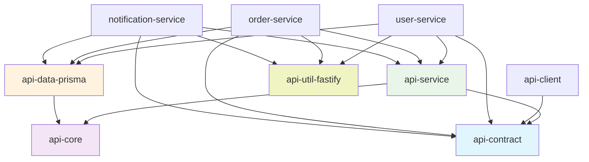

# @inh-lib/api-util-fastify

A TypeScript-first Fastify adapter that provides a unified HTTP context abstraction for building framework-agnostic web services.

## Features

✨ **Framework Agnostic** - Use the same business logic across Fastify, Express, and Koa  
🎯 **TypeScript First** - Full type safety with generic support  
🔧 **Function-based API** - Easy to test and compose  
⚡ **Performance** - Minimal overhead with efficient adapters  
🧪 **Well Tested** - Comprehensive test coverage  
📦 **Tree-shakable** - Import only what you need  

## Installation

```bash
# npm
npm install @inh-lib/api-util-fastify

# yarn
yarn add @inh-lib/api-util-fastify

# pnpm
pnpm add @inh-lib/api-util-fastify
```

### Peer Dependencies

```bash
npm install fastify @inh-lib/common
```

## Quick Start

### Basic Usage

```typescript
import { FastifyInstance } from 'fastify';
import { createFastifyContext } from '@inh-lib/api-util-fastify';
import { getRequestBody, sendResponse } from '@inh-lib/common';

const fastify: FastifyInstance = require('fastify')({ logger: true });

// Register a route with unified context
fastify.post('/users', async (request, reply) => {
  const context = createFastifyContext(request, reply);
  
  // Use unified helper functions
  const userData = getRequestBody(context);
  
  // Your business logic here
  const newUser = await createUser(userData);
  
  // Send response
  sendResponse(context, newUser, 201);
});

// Type-safe request handling
interface CreateUserRequest {
  email: string;
  firstName: string;
  lastName: string;
  age?: number;
}

fastify.post<{ Body: CreateUserRequest }>('/users', async (request, reply) => {
  const context = createFastifyContext<CreateUserRequest>(request, reply);
  
  const userData = getRequestBody<CreateUserRequest>(context);
  // userData is now fully typed
  
  const user = {
    id: generateId(),
    email: userData.email,
    firstName: userData.firstName,
    lastName: userData.lastName,
    age: userData.age,
    createdAt: new Date(),
  };
  
  sendResponse(context, user, 201);
});
```

### Advanced Usage with Services

```typescript
import { UnifiedHttpContext } from '@inh-lib/common';

// Framework-agnostic service
class UserService {
  async createUser(context: UnifiedHttpContext): Promise<void> {
    try {
      const userData = getRequestBody<CreateUserRequest>(context);
      
      // Validation
      if (!userData.email || !userData.firstName) {
        sendError(context, 'Missing required fields', 422);
        return;
      }
      
      // Business logic
      const user = await this.userRepository.create(userData);
      
      sendResponse(context, user, 201);
    } catch (error) {
      sendError(context, 'Failed to create user', 500);
    }
  }
}

// Use in Fastify route
const userService = new UserService();

fastify.post('/users', async (request, reply) => {
  const context = createFastifyContext(request, reply);
  await userService.createUser(context);
});
```

## API Reference

### Core Functions

#### `createFastifyContext<TBody>(request, reply)`

Creates a unified HTTP context from Fastify request and reply objects.

**Parameters:**
- `request: FastifyRequest` - Fastify request object
- `reply: FastifyReply` - Fastify reply object

**Type Parameters:**
- `TBody` - Type of the request body (optional, defaults to `Record<string, unknown>`)

**Returns:** `UnifiedHttpContext & { request: UnifiedRequestContext & { body: TBody } }`

```typescript
// Basic usage
const context = createFastifyContext(request, reply);

// With typed body
const context = createFastifyContext<UserCreateRequest>(request, reply);
```

#### `adaptFastifyRequest<TBody>(request)`

Adapts a Fastify request to unified request context.

**Parameters:**
- `request: FastifyRequest` - Fastify request object

**Returns:** `UnifiedRequestContext & { body: TBody }`

```typescript
const unifiedRequest = adaptFastifyRequest<UserData>(request);
```

#### `adaptFastifyResponse(reply)`

Adapts a Fastify reply to unified response context.

**Parameters:**
- `reply: FastifyReply` - Fastify reply object

**Returns:** `UnifiedResponseContext`

```typescript
const unifiedResponse = adaptFastifyResponse(reply);
```

### Helper Functions (from @inh-lib/common)

#### Request Helpers

```typescript
// Get request body with type safety
const body = getRequestBody<UserCreateRequest>(context);

// Get URL parameters
const params = getParams(context); // { id: "123", category: "users" }

// Get query parameters
const query = getQuery(context); // { page: "1", limit: "10" }

// Get headers
const headers = getHeaders(context);
```

#### Response Helpers

```typescript
// Send successful response
sendResponse(context, data, 200); // status code optional, defaults to 200

// Send error response
sendError(context, 'Validation failed', 422); // status code optional, defaults to 400
```

## TypeScript Support

### Request Body Types

```typescript
interface CreateUserRequest {
  email: string;
  firstName: string;
  lastName: string;
  age?: number;
  preferences?: {
    theme: 'light' | 'dark';
    notifications: boolean;
  };
}

interface UpdateUserRequest {
  email?: string;
  firstName?: string;
  lastName?: string;
  age?: number;
}

// Use with full type safety
fastify.post<{ Body: CreateUserRequest }>('/users', async (request, reply) => {
  const context = createFastifyContext<CreateUserRequest>(request, reply);
  const userData = getRequestBody<CreateUserRequest>(context);
  
  // userData.email is string
  // userData.age is number | undefined
  // userData.preferences?.theme is 'light' | 'dark' | undefined
});
```

### Response Types

```typescript
interface UserResponse {
  id: string;
  email: string;
  firstName: string;
  lastName: string;
  createdAt: Date;
  updatedAt: Date;
}

interface ApiResponse<T> {
  success: boolean;
  data: T;
  message?: string;
}

// Type-safe responses
const user: UserResponse = await createUser(userData);
const response: ApiResponse<UserResponse> = {
  success: true,
  data: user,
  message: 'User created successfully'
};

sendResponse(context, response, 201);
```

### Union Types and Complex Structures

```typescript
interface TextMessage {
  type: 'text';
  content: string;
}

interface ImageMessage {
  type: 'image';
  url: string;
  alt?: string;
}

type Message = TextMessage | ImageMessage;

fastify.post<{ Body: Message }>('/messages', async (request, reply) => {
  const context = createFastifyContext<Message>(request, reply);
  const message = getRequestBody<Message>(context);
  
  // Type narrowing works correctly
  if (message.type === 'text') {
    console.log(message.content); // TypeScript knows this exists
  } else {
    console.log(message.url); // TypeScript knows this exists
  }
});
```

## Framework-Agnostic Route Library

The most powerful pattern is to create your route logic as a separate library that's completely independent of any HTTP framework. Your Fastify routes then become thin adapter layers.

### Creating Framework-Agnostic Route Library

```typescript
// lib/routes/user-routes.ts
import { UnifiedHttpContext, getRequestBody, getParams, getQuery, sendResponse, sendError } from '@inh-lib/common';

// Pure interfaces - no framework dependencies
interface CreateUserRequest {
  email: string;
  firstName: string;
  lastName: string;
  age?: number;
}

interface UpdateUserRequest {
  email?: string;
  firstName?: string;
  lastName?: string;
  age?: number;
}

interface UserResponse {
  id: string;
  email: string;
  firstName: string;
  lastName: string;
  age?: number;
  createdAt: Date;
  updatedAt: Date;
}

interface PaginatedUsersResponse {
  data: UserResponse[];
  pagination: {
    page: number;
    limit: number;
    total: number;
    totalPages: number;
  };
}

// Framework-agnostic route handlers
export class UserRoutes {
  constructor(private userService: UserService) {}

  async createUser(context: UnifiedHttpContext): Promise<void> {
    try {
      const userData = getRequestBody<CreateUserRequest>(context);
      
      // Validation
      const errors: string[] = [];
      if (!userData.email) errors.push('Email is required');
      if (!userData.firstName) errors.push('First name is required');
      if (!userData.lastName) errors.push('Last name is required');
      
      if (errors.length > 0) {
        sendError(context, 'Validation failed', 422);
        return;
      }
      
      // Business logic
      const user = await this.userService.createUser(userData);
      
      sendResponse(context, user, 201);
    } catch (error) {
      console.error('Create user error:', error);
      sendError(context, 'Failed to create user', 500);
    }
  }

  async getUsers(context: UnifiedHttpContext): Promise<void> {
    try {
      const query = getQuery(context);
      const page = Math.max(1, Number(query.page) || 1);
      const limit = Math.min(100, Math.max(1, Number(query.limit) || 10));
      const search = typeof query.search === 'string' ? query.search : undefined;
      
      const result = await this.userService.getUsers({
        page,
        limit,
        search,
      });
      
      const response: PaginatedUsersResponse = {
        data: result.users,
        pagination: {
          page,
          limit,
          total: result.total,
          totalPages: Math.ceil(result.total / limit),
        },
      };
      
      sendResponse(context, response);
    } catch (error) {
      console.error('Get users error:', error);
      sendError(context, 'Failed to fetch users', 500);
    }
  }

  async getUserById(context: UnifiedHttpContext): Promise<void> {
    try {
      const params = getParams(context);
      const userId = params['id'];
      
      if (!userId) {
        sendError(context, 'User ID is required', 400);
        return;
      }
      
      const user = await this.userService.getUserById(userId);
      
      if (!user) {
        sendError(context, 'User not found', 404);
        return;
      }
      
      sendResponse(context, user);
    } catch (error) {
      console.error('Get user error:', error);
      sendError(context, 'Failed to fetch user', 500);
    }
  }

  async updateUser(context: UnifiedHttpContext): Promise<void> {
    try {
      const params = getParams(context);
      const userId = params['id'];
      const updateData = getRequestBody<UpdateUserRequest>(context);
      
      if (!userId) {
        sendError(context, 'User ID is required', 400);
        return;
      }
      
      const user = await this.userService.updateUser(userId, updateData);
      
      if (!user) {
        sendError(context, 'User not found', 404);
        return;
      }
      
      sendResponse(context, user);
    } catch (error) {
      console.error('Update user error:', error);
      sendError(context, 'Failed to update user', 500);
    }
  }

  async deleteUser(context: UnifiedHttpContext): Promise<void> {
    try {
      const params = getParams(context);
      const userId = params['id'];
      
      if (!userId) {
        sendError(context, 'User ID is required', 400);
        return;
      }
      
      const deleted = await this.userService.deleteUser(userId);
      
      if (!deleted) {
        sendError(context, 'User not found', 404);
        return;
      }
      
      sendResponse(context, { message: 'User deleted successfully' });
    } catch (error) {
      console.error('Delete user error:', error);
      sendError(context, 'Failed to delete user', 500);
    }
  }
}

// Business logic service (also framework-agnostic)
export interface UserService {
  createUser(userData: CreateUserRequest): Promise<UserResponse>;
  getUsers(options: { page: number; limit: number; search?: string }): Promise<{ users: UserResponse[]; total: number }>;
  getUserById(id: string): Promise<UserResponse | null>;
  updateUser(id: string, updateData: UpdateUserRequest): Promise<UserResponse | null>;
  deleteUser(id: string): Promise<boolean>;
}

// Example implementation
export class UserServiceImpl implements UserService {
  constructor(private userRepository: UserRepository) {}

  async createUser(userData: CreateUserRequest): Promise<UserResponse> {
    const user: UserResponse = {
      id: this.generateId(),
      email: userData.email,
      firstName: userData.firstName,
      lastName: userData.lastName,
      age: userData.age,
      createdAt: new Date(),
      updatedAt: new Date(),
    };
    
    return await this.userRepository.save(user);
  }

  async getUsers(options: { page: number; limit: number; search?: string }) {
    return await this.userRepository.findPaginated(options);
  }

  async getUserById(id: string): Promise<UserResponse | null> {
    return await this.userRepository.findById(id);
  }

  async updateUser(id: string, updateData: UpdateUserRequest): Promise<UserResponse | null> {
    const existingUser = await this.userRepository.findById(id);
    if (!existingUser) return null;
    
    const updatedUser: UserResponse = {
      ...existingUser,
      ...updateData,
      updatedAt: new Date(),
    };
    
    return await this.userRepository.save(updatedUser);
  }

  async deleteUser(id: string): Promise<boolean> {
    return await this.userRepository.deleteById(id);
  }

  private generateId(): string {
    return Math.random().toString(36).substring(2) + Date.now().toString(36);
  }
}
```

### Fastify as Thin Adapter Layer

```typescript
// fastify/user-routes.ts
import { FastifyInstance, FastifyRequest, FastifyReply } from 'fastify';
import { createFastifyContext } from '@inh-lib/api-util-fastify';
import { UserRoutes, UserServiceImpl } from '../lib/routes/user-routes';

// Initialize your services
const userService = new UserServiceImpl(userRepository);
const userRoutes = new UserRoutes(userService);

// Fastify routes become thin adapters - no business logic here!
export function registerUserRoutes(fastify: FastifyInstance) {
  // Create user - just adapter logic
  fastify.post<{ Body: CreateUserRequest }>('/users', async (request: FastifyRequest, reply: FastifyReply) => {
    const context = createFastifyContext(request, reply);
    await userRoutes.createUser(context);
  });

  // Get users - just adapter logic
  fastify.get('/users', async (request: FastifyRequest, reply: FastifyReply) => {
    const context = createFastifyContext(request, reply);
    await userRoutes.getUsers(context);
  });

  // Get user by ID - just adapter logic
  fastify.get<{ Params: { id: string } }>('/users/:id', async (request: FastifyRequest, reply: FastifyReply) => {
    const context = createFastifyContext(request, reply);
    await userRoutes.getUserById(context);
  });

  // Update user - just adapter logic
  fastify.put<{ Params: { id: string }; Body: UpdateUserRequest }>('/users/:id', async (request: FastifyRequest, reply: FastifyReply) => {
    const context = createFastifyContext(request, reply);
    await userRoutes.updateUser(context);
  });

  // Delete user - just adapter logic
  fastify.delete<{ Params: { id: string } }>('/users/:id', async (request: FastifyRequest, reply: FastifyReply) => {
    const context = createFastifyContext(request, reply);
    await userRoutes.deleteUser(context);
  });
}

// Usage in main Fastify app
const fastify: FastifyInstance = require('fastify')({ logger: true });

// Register routes
registerUserRoutes(fastify);

// Start server
const start = async () => {
  try {
    await fastify.listen({ port: 3000 });
    console.log('Server listening on port 3000');
  } catch (err) {
    fastify.log.error(err);
    process.exit(1);
  }
};

start();
```

### Complete Framework Independence

The beauty of this approach is that your routes can now work with any framework:

```typescript
// express/user-routes.ts (when Express adapter is available)
import { Express } from 'express';
import { createExpressContext } from '@inh-lib/api-util-express';
import { UserRoutes } from '../lib/routes/user-routes';

export function registerUserRoutes(app: Express, userRoutes: UserRoutes) {
  // Same route logic, different adapter
  app.post('/users', async (req, res) => {
    const context = createExpressContext(req, res);
    await userRoutes.createUser(context);
  });

  app.get('/users', async (req, res) => {
    const context = createExpressContext(req, res);
    await userRoutes.getUsers(context);
  });

  // ... other routes
}

// koa/user-routes.ts (when Koa adapter is available)
import { Context } from 'koa';
import { createKoaContext } from '@inh-lib/api-util-koa';
import { UserRoutes } from '../lib/routes/user-routes';

export function registerUserRoutes(router: any, userRoutes: UserRoutes) {
  // Same route logic, different adapter
  router.post('/users', async (ctx: Context) => {
    const context = createKoaContext(ctx);
    await userRoutes.createUser(context);
  });

  router.get('/users', async (ctx: Context) => {
    const context = createKoaContext(ctx);
    await userRoutes.getUsers(context);
  });

  // ... other routes
}
```

### Advanced: Generic Route Factory

For even more reusability, you can create a generic route factory:

```typescript
// lib/route-factory.ts
import { UnifiedHttpContext } from '@inh-lib/common';

export interface RouteHandler {
  (context: UnifiedHttpContext): Promise<void>;
}

export interface RouteDefinition {
  method: 'GET' | 'POST' | 'PUT' | 'DELETE' | 'PATCH';
  path: string;
  handler: RouteHandler;
  middleware?: RouteHandler[];
}

// Create reusable route definitions
export function createUserRouteDefinitions(userRoutes: UserRoutes): RouteDefinition[] {
  return [
    {
      method: 'POST',
      path: '/users',
      handler: (context) => userRoutes.createUser(context),
    },
    {
      method: 'GET',
      path: '/users',
      handler: (context) => userRoutes.getUsers(context),
    },
    {
      method: 'GET',
      path: '/users/:id',
      handler: (context) => userRoutes.getUserById(context),
    },
    {
      method: 'PUT',
      path: '/users/:id',
      handler: (context) => userRoutes.updateUser(context),
    },
    {
      method: 'DELETE',
      path: '/users/:id',
      handler: (context) => userRoutes.deleteUser(context),
    },
  ];
}

// Framework adapters
export function registerFastifyRoutes(fastify: FastifyInstance, routes: RouteDefinition[]) {
  routes.forEach(route => {
    const method = route.method.toLowerCase() as 'get' | 'post' | 'put' | 'delete' | 'patch';
    
    fastify[method](route.path, async (request: FastifyRequest, reply: FastifyReply) => {
      const context = createFastifyContext(request, reply);
      
      // Apply middleware if any
      if (route.middleware) {
        for (const middleware of route.middleware) {
          await middleware(context);
        }
      }
      
      // Execute handler
      await route.handler(context);
    });
  });
}

// Usage
const userRoutes = new UserRoutes(userService);
const routeDefinitions = createUserRouteDefinitions(userRoutes);

// Register with any framework
registerFastifyRoutes(fastify, routeDefinitions);
// registerExpressRoutes(express, routeDefinitions);  // When available
// registerKoaRoutes(koaRouter, routeDefinitions);   // When available
```

### Testing Framework-Agnostic Routes

```typescript
// lib/__tests__/user-routes.test.ts
import { UserRoutes } from '../routes/user-routes';
import { createMockContext } from '@inh-lib/common/testing';

describe('UserRoutes', () => {
  let userRoutes: UserRoutes;
  let mockUserService: jest.Mocked<UserService>;

  beforeEach(() => {
    mockUserService = {
      createUser: jest.fn(),
      getUsers: jest.fn(),
      getUserById: jest.fn(),
      updateUser: jest.fn(),
      deleteUser: jest.fn(),
    };
    
    userRoutes = new UserRoutes(mockUserService);
  });

  describe('createUser', () => {
    it('should create user successfully', async () => {
      const mockContext = createMockContext({
        body: {
          email: 'test@example.com',
          firstName: 'John',
          lastName: 'Doe',
        },
      });

      const mockUser = {
        id: '123',
        email: 'test@example.com',
        firstName: 'John',
        lastName: 'Doe',
        createdAt: new Date(),
        updatedAt: new Date(),
      };

      mockUserService.createUser.mockResolvedValue(mockUser);

      await userRoutes.createUser(mockContext);

      expect(mockUserService.createUser).toHaveBeenCalledWith({
        email: 'test@example.com',
        firstName: 'John',
        lastName: 'Doe',
      });

      expect(mockContext.response.status).toHaveBeenCalledWith(201);
      expect(mockContext.response.json).toHaveBeenCalledWith(mockUser);
    });

    it('should handle validation errors', async () => {
      const mockContext = createMockContext({
        body: {
          email: '', // Invalid email
          firstName: 'John',
        },
      });

      await userRoutes.createUser(mockContext);

      expect(mockUserService.createUser).not.toHaveBeenCalled();
      expect(mockContext.response.status).toHaveBeenCalledWith(422);
      expect(mockContext.response.json).toHaveBeenCalledWith(
        expect.objectContaining({
          error: 'Validation failed',
        })
      );
    });
  });

  // ... more tests for other methods
});
```

### Benefits of This Approach

1. **Complete Framework Independence**: Your business logic has zero framework dependencies
2. **Easy Testing**: Test your routes without any HTTP framework mocking
3. **Framework Migration**: Switch frameworks by changing only the thin adapter layer
4. **Code Reuse**: Use the same routes across multiple applications/frameworks
5. **Separation of Concerns**: HTTP concerns are separated from business logic
6. **Type Safety**: Full TypeScript support throughout
7. **Easy Maintenance**: Framework updates don't affect your business logic

### Project Structure Example

```
src/
├── lib/                          # Framework-agnostic business logic
│   ├── routes/
│   │   ├── user-routes.ts        # Pure route logic
│   │   ├── auth-routes.ts
│   │   └── admin-routes.ts
│   ├── services/
│   │   ├── user-service.ts       # Business logic
│   │   └── auth-service.ts
│   └── __tests__/                # Framework-agnostic tests
│       ├── user-routes.test.ts
│       └── auth-routes.test.ts
├── fastify/                      # Fastify-specific adapters
│   ├── routes/
│   │   ├── user-routes.ts        # Thin Fastify adapters
│   │   └── auth-routes.ts
│   ├── middleware/
│   │   └── fastify-auth.ts
│   └── server.ts                 # Fastify server setup
├── express/                      # Express adapters (future)
│   └── routes/
└── shared/
    ├── types.ts                  # Shared interfaces
    └── config.ts
```

This pattern gives you maximum flexibility while maintaining type safety and testability. Your core business logic remains completely independent of any HTTP framework, making your application more maintainable and portable.

## Schema Validation with Zod

For robust request validation, we recommend using [Zod](https://zod.dev/) - a TypeScript-first schema validation library that integrates seamlessly with our unified context approach.

### Installation

```bash
# Install Zod
npm install zod

# For TypeScript users (usually already installed)
npm install -D typescript
```

### Creating Zod Schemas

```typescript
// lib/schemas/user-schemas.ts
import { z } from 'zod';

// Base user schema
export const UserSchema = z.object({
  id: z.string().uuid(),
  email: z.string().email('Invalid email format'),
  firstName: z.string().min(1, 'First name is required').max(50, 'First name too long'),
  lastName: z.string().min(1, 'Last name is required').max(50, 'Last name too long'),
  age: z.number().int().min(13, 'Must be at least 13 years old').max(120, 'Invalid age').optional(),
  createdAt: z.date(),
  updatedAt: z.date(),
});

// Request schemas
export const CreateUserRequestSchema = z.object({
  email: z.string().email('Invalid email format'),
  firstName: z.string().min(1, 'First name is required').max(50, 'First name too long'),
  lastName: z.string().min(1, 'Last name is required').max(50, 'Last name too long'),
  age: z.number().int().min(13, 'Must be at least 13 years old').max(120, 'Invalid age').optional(),
});

export const UpdateUserRequestSchema = CreateUserRequestSchema.partial();

export const GetUsersQuerySchema = z.object({
  page: z.string().regex(/^\d+$/, 'Page must be a number').transform(Number).default('1'),
  limit: z.string().regex(/^\d+$/, 'Limit must be a number').transform(Number).default('10'),
  search: z.string().optional(),
  sort: z.enum(['email', 'firstName', 'lastName', 'createdAt']).optional(),
  order: z.enum(['asc', 'desc']).default('asc'),
});

export const UserParamsSchema = z.object({
  id: z.string().uuid('Invalid user ID format'),
});

// Infer TypeScript types from schemas
export type User = z.infer<typeof UserSchema>;
export type CreateUserRequest = z.infer<typeof CreateUserRequestSchema>;
export type UpdateUserRequest = z.infer<typeof UpdateUserRequestSchema>;
export type GetUsersQuery = z.infer<typeof GetUsersQuerySchema>;
export type UserParams = z.infer<typeof UserParamsSchema>;

// Complex validation examples
export const CreateUserWithProfileSchema = z.object({
  email: z.string().email(),
  firstName: z.string().min(1).max(50),
  lastName: z.string().min(1).max(50),
  age: z.number().int().min(13).max(120).optional(),
  profile: z.object({
    bio: z.string().max(500).optional(),
    website: z.string().url().optional(),
    location: z.string().max(100).optional(),
    avatar: z.string().url().optional(),
  }).optional(),
  preferences: z.object({
    theme: z.enum(['light', 'dark', 'auto']).default('light'),
    notifications: z.object({
      email: z.boolean().default(true),
      push: z.boolean().default(true),
      sms: z.boolean().default(false),
    }).default({}),
    language: z.string().length(2).default('en'),
  }).default({}),
});

export type CreateUserWithProfile = z.infer<typeof CreateUserWithProfileSchema>;
```

### Validation Helper Functions

```typescript
// lib/utils/validation.ts
import { z } from 'zod';
import { UnifiedHttpContext, getRequestBody, getParams, getQuery, sendError } from '@inh-lib/common';

export interface ValidationResult<T> {
  success: true;
  data: T;
}

export interface ValidationError {
  success: false;
  errors: Array<{
    field: string;
    message: string;
    code: string;
  }>;
}

export type ValidationResponse<T> = ValidationResult<T> | ValidationError;

// Generic validation function
export function validateData<T>(schema: z.ZodSchema<T>, data: unknown): ValidationResponse<T> {
  try {
    const result = schema.parse(data);
    return { success: true, data: result };
  } catch (error) {
    if (error instanceof z.ZodError) {
      const errors = error.errors.map(err => ({
        field: err.path.join('.'),
        message: err.message,
        code: err.code,
      }));
      return { success: false, errors };
    }
    
    return {
      success: false,
      errors: [{ field: 'unknown', message: 'Validation failed', code: 'invalid_type' }],
    };
  }
}

// Context-aware validation helpers
export function validateRequestBody<T>(
  context: UnifiedHttpContext,
  schema: z.ZodSchema<T>
): ValidationResponse<T> {
  const body = getRequestBody(context);
  return validateData(schema, body);
}

export function validateParams<T>(
  context: UnifiedHttpContext,
  schema: z.ZodSchema<T>
): ValidationResponse<T> {
  const params = getParams(context);
  return validateData(schema, params);
}

export function validateQuery<T>(
  context: UnifiedHttpContext,
  schema: z.ZodSchema<T>
): ValidationResponse<T> {
  const query = getQuery(context);
  return validateData(schema, query);
}

// Auto-send validation errors
export function validateRequestBodyOrError<T>(
  context: UnifiedHttpContext,
  schema: z.ZodSchema<T>
): T | null {
  const validation = validateRequestBody(context, schema);
  
  if (!validation.success) {
    sendError(context, 'Validation failed', 422, {
      code: 'VALIDATION_ERROR',
      details: validation.errors,
    });
    return null;
  }
  
  return validation.data;
}

export function validateParamsOrError<T>(
  context: UnifiedHttpContext,
  schema: z.ZodSchema<T>
): T | null {
  const validation = validateParams(context, schema);
  
  if (!validation.success) {
    sendError(context, 'Invalid parameters', 400, {
      code: 'INVALID_PARAMS',
      details: validation.errors,
    });
    return null;
  }
  
  return validation.data;
}

export function validateQueryOrError<T>(
  context: UnifiedHttpContext,
  schema: z.ZodSchema<T>
): T | null {
  const validation = validateQuery(context, schema);
  
  if (!validation.success) {
    sendError(context, 'Invalid query parameters', 400, {
      code: 'INVALID_QUERY',
      details: validation.errors,
    });
    return null;
  }
  
  return validation.data;
}

// Enhanced sendError function that supports validation details
declare module '@inh-lib/common' {
  function sendError(
    context: UnifiedHttpContext, 
    message: string, 
    statusCode?: number,
    extras?: {
      code?: string;
      details?: Array<{ field: string; message: string; code: string }>;
    }
  ): void;
}
```

### Framework-Agnostic Routes with Zod Validation

```typescript
// lib/routes/user-routes-with-validation.ts
import { UnifiedHttpContext } from '@inh-lib/common';
import {
  CreateUserRequestSchema,
  UpdateUserRequestSchema,
  GetUsersQuerySchema,
  UserParamsSchema,
  CreateUserWithProfileSchema,
} from '../schemas/user-schemas';
import {
  validateRequestBodyOrError,
  validateParamsOrError,
  validateQueryOrError,
} from '../utils/validation';

export class UserRoutesWithValidation {
  constructor(private userService: UserService) {}

  async createUser(context: UnifiedHttpContext): Promise<void> {
    // Validate request body with Zod
    const userData = validateRequestBodyOrError(context, CreateUserRequestSchema);
    if (!userData) return; // Validation error already sent

    try {
      // userData is now fully typed and validated
      const user = await this.userService.createUser(userData);
      sendResponse(context, user, 201);
    } catch (error) {
      console.error('Create user error:', error);
      sendError(context, 'Failed to create user', 500);
    }
  }

  async createUserWithProfile(context: UnifiedHttpContext): Promise<void> {
    // Validate complex nested structure
    const userData = validateRequestBodyOrError(context, CreateUserWithProfileSchema);
    if (!userData) return;

    try {
      // All nested objects are validated and typed
      const user = await this.userService.createUserWithProfile(userData);
      sendResponse(context, user, 201);
    } catch (error) {
      console.error('Create user with profile error:', error);
      sendError(context, 'Failed to create user', 500);
    }
  }

  async getUsers(context: UnifiedHttpContext): Promise<void> {
    // Validate and transform query parameters
    const queryParams = validateQueryOrError(context, GetUsersQuerySchema);
    if (!queryParams) return;

    try {
      // queryParams.page and queryParams.limit are now numbers (transformed by Zod)
      const result = await this.userService.getUsers(queryParams);
      
      const response = {
        data: result.users,
        pagination: {
          page: queryParams.page,
          limit: queryParams.limit,
          total: result.total,
          totalPages: Math.ceil(result.total / queryParams.limit),
        },
      };
      
      sendResponse(context, response);
    } catch (error) {
      console.error('Get users error:', error);
      sendError(context, 'Failed to fetch users', 500);
    }
  }

  async getUserById(context: UnifiedHttpContext): Promise<void> {
    // Validate URL parameters
    const params = validateParamsOrError(context, UserParamsSchema);
    if (!params) return;

    try {
      // params.id is validated as UUID
      const user = await this.userService.getUserById(params.id);
      
      if (!user) {
        sendError(context, 'User not found', 404);
        return;
      }
      
      sendResponse(context, user);
    } catch (error) {
      console.error('Get user error:', error);
      sendError(context, 'Failed to fetch user', 500);
    }
  }

  async updateUser(context: UnifiedHttpContext): Promise<void> {
    // Validate both params and body
    const params = validateParamsOrError(context, UserParamsSchema);
    if (!params) return;

    const updateData = validateRequestBodyOrError(context, UpdateUserRequestSchema);
    if (!updateData) return;

    try {
      const user = await this.userService.updateUser(params.id, updateData);
      
      if (!user) {
        sendError(context, 'User not found', 404);
        return;
      }
      
      sendResponse(context, user);
    } catch (error) {
      console.error('Update user error:', error);
      sendError(context, 'Failed to update user', 500);
    }
  }

  async deleteUser(context: UnifiedHttpContext): Promise<void> {
    const params = validateParamsOrError(context, UserParamsSchema);
    if (!params) return;

    try {
      const deleted = await this.userService.deleteUser(params.id);
      
      if (!deleted) {
        sendError(context, 'User not found', 404);
        return;
      }
      
      sendResponse(context, { message: 'User deleted successfully' });
    } catch (error) {
      console.error('Delete user error:', error);
      sendError(context, 'Failed to delete user', 500);
    }
  }
}
```

### Advanced Zod Patterns

```typescript
// lib/schemas/advanced-patterns.ts
import { z } from 'zod';

// Custom validation functions
const isValidPhoneNumber = (phone: string) => {
  const phoneRegex = /^[\+]?[1-9][\d]{0,15}$/;
  return phoneRegex.test(phone);
};

// Conditional validation
export const UserRegistrationSchema = z.object({
  email: z.string().email(),
  password: z.string().min(8, 'Password must be at least 8 characters'),
  confirmPassword: z.string(),
  firstName: z.string().min(1),
  lastName: z.string().min(1),
  phone: z.string().refine(isValidPhoneNumber, 'Invalid phone number format').optional(),
  acceptTerms: z.boolean().refine(val => val === true, 'Must accept terms and conditions'),
  marketingOptIn: z.boolean().default(false),
  birthDate: z.string().datetime().optional(),
  // Conditional field - only required if user is under 18
  parentalConsent: z.boolean().optional(),
}).refine(data => data.password === data.confirmPassword, {
  message: "Passwords don't match",
  path: ['confirmPassword'],
}).refine(data => {
  // If birthDate is provided and user is under 18, parentalConsent is required
  if (data.birthDate) {
    const age = new Date().getFullYear() - new Date(data.birthDate).getFullYear();
    if (age < 18) {
      return data.parentalConsent === true;
    }
  }
  return true;
}, {
  message: 'Parental consent required for users under 18',
  path: ['parentalConsent'],
});

// Union types with discriminated unions
export const NotificationSchema = z.discriminatedUnion('type', [
  z.object({
    type: z.literal('email'),
    to: z.string().email(),
    subject: z.string(),
    body: z.string(),
    template: z.string().optional(),
  }),
  z.object({
    type: z.literal('sms'),
    to: z.string().refine(isValidPhoneNumber, 'Invalid phone number'),
    message: z.string().max(160, 'SMS message too long'),
  }),
  z.object({
    type: z.literal('push'),
    deviceId: z.string(),
    title: z.string().max(50),
    body: z.string().max(200),
    data: z.record(z.string()).optional(),
  }),
]);

// Array validation with custom constraints
export const BulkUserCreateSchema = z.object({
  users: z.array(CreateUserRequestSchema)
    .min(1, 'At least one user is required')
    .max(100, 'Cannot create more than 100 users at once')
    .refine(users => {
      // Check for duplicate emails
      const emails = users.map(user => user.email);
      return new Set(emails).size === emails.length;
    }, 'Duplicate emails are not allowed'),
});

// File upload validation
export const FileUploadSchema = z.object({
  filename: z.string().min(1, 'Filename is required'),
  mimetype: z.enum(['image/jpeg', 'image/png', 'image/gif', 'application/pdf']),
  size: z.number().max(5 * 1024 * 1024, 'File size must be less than 5MB'),
  buffer: z.instanceof(Buffer),
});

// Pagination with sorting
export const PaginationSchema = z.object({
  page: z.string().regex(/^\d+$/).transform(Number).refine(n => n > 0, 'Page must be positive'),
  limit: z.string().regex(/^\d+$/).transform(Number).refine(n => n > 0 && n <= 100, 'Limit must be between 1 and 100'),
  sortBy: z.string().optional(),
  sortOrder: z.enum(['asc', 'desc']).default('asc'),
  filters: z.record(z.string()).optional(),
});

// API versioning
export const ApiVersionSchema = z.object({
  version: z.enum(['v1', 'v2', 'v3']).default('v1'),
});

export type UserRegistration = z.infer<typeof UserRegistrationSchema>;
export type Notification = z.infer<typeof NotificationSchema>;
export type BulkUserCreate = z.infer<typeof BulkUserCreateSchema>;
export type FileUpload = z.infer<typeof FileUploadSchema>;
export type Pagination = z.infer<typeof PaginationSchema>;
export type ApiVersion = z.infer<typeof ApiVersionSchema>;
```

### Fastify Integration with Zod

```typescript
// fastify/routes/user-routes-validated.ts
import { FastifyInstance, FastifyRequest, FastifyReply } from 'fastify';
import { createFastifyContext } from '@inh-lib/api-util-fastify';
import { UserRoutesWithValidation } from '../../lib/routes/user-routes-with-validation';

// Fastify routes with Zod validation
export function registerValidatedUserRoutes(fastify: FastifyInstance, userRoutes: UserRoutesWithValidation) {
  // The validation happens in the route handler, so Fastify routes remain simple
  
  fastify.post('/users', {
    schema: {
      // Optional: Add Fastify schema for documentation/OpenAPI
      description: 'Create a new user',
      tags: ['users'],
      body: {
        type: 'object',
        required: ['email', 'firstName', 'lastName'],
        properties: {
          email: { type: 'string', format: 'email' },
          firstName: { type: 'string', minLength: 1, maxLength: 50 },
          lastName: { type: 'string', minLength: 1, maxLength: 50 },
          age: { type: 'integer', minimum: 13, maximum: 120 },
        },
      },
      response: {
        201: {
          type: 'object',
          properties: {
            id: { type: 'string' },
            email: { type: 'string' },
            firstName: { type: 'string' },
            lastName: { type: 'string' },
            createdAt: { type: 'string' },
            updatedAt: { type: 'string' },
          },
        },
      },
    },
  }, async (request: FastifyRequest, reply: FastifyReply) => {
    const context = createFastifyContext(request, reply);
    await userRoutes.createUser(context); // Zod validation happens here
  });

  fastify.get('/users', async (request: FastifyRequest, reply: FastifyReply) => {
    const context = createFastifyContext(request, reply);
    await userRoutes.getUsers(context);
  });

  fastify.get('/users/:id', async (request: FastifyRequest, reply: FastifyReply) => {
    const context = createFastifyContext(request, reply);
    await userRoutes.getUserById(context);
  });

  fastify.put('/users/:id', async (request: FastifyRequest, reply: FastifyReply) => {
    const context = createFastifyContext(request, reply);
    await userRoutes.updateUser(context);
  });

  fastify.delete('/users/:id', async (request: FastifyRequest, reply: FastifyReply) => {
    const context = createFastifyContext(request, reply);
    await userRoutes.deleteUser(context);
  });

  // Advanced route with complex validation
  fastify.post('/users/with-profile', async (request: FastifyRequest, reply: FastifyReply) => {
    const context = createFastifyContext(request, reply);
    await userRoutes.createUserWithProfile(context);
  });
}
```

### Testing with Zod Schemas

```typescript
// lib/__tests__/user-routes-validation.test.ts
import { UserRoutesWithValidation } from '../routes/user-routes-with-validation';
import { CreateUserRequestSchema, UserParamsSchema } from '../schemas/user-schemas';
import { validateData } from '../utils/validation';
import { createMockContext } from '@inh-lib/common/testing';

describe('User Routes Validation', () => {
  let userRoutes: UserRoutesWithValidation;
  let mockUserService: jest.Mocked<UserService>;

  beforeEach(() => {
    mockUserService = {
      createUser: jest.fn(),
      getUserById: jest.fn(),
      // ... other methods
    };
    
    userRoutes = new UserRoutesWithValidation(mockUserService);
  });

  describe('Schema Validation', () => {
    it('should validate correct user data', () => {
      const validData = {
        email: 'test@example.com',
        firstName: 'John',
        lastName: 'Doe',
        age: 25,
      };

      const result = validateData(CreateUserRequestSchema, validData);

      expect(result.success).toBe(true);
      if (result.success) {
        expect(result.data).toEqual(validData);
      }
    });

    it('should reject invalid email', () => {
      const invalidData = {
        email: 'not-an-email',
        firstName: 'John',
        lastName: 'Doe',
      };

      const result = validateData(CreateUserRequestSchema, invalidData);

      expect(result.success).toBe(false);
      if (!result.success) {
        expect(result.errors).toContainEqual({
          field: 'email',
          message: 'Invalid email format',
          code: 'invalid_string',
        });
      }
    });

    it('should reject missing required fields', () => {
      const invalidData = {
        email: 'test@example.com',
        // Missing firstName and lastName
      };

      const result = validateData(CreateUserRequestSchema, invalidData);

      expect(result.success).toBe(false);
      if (!result.success) {
        expect(result.errors).toHaveLength(2);
        expect(result.errors.map(e => e.field)).toContain('firstName');
        expect(result.errors.map(e => e.field)).toContain('lastName');
      }
    });

    it('should validate UUID parameters', () => {
      const validParams = { id: '123e4567-e89b-12d3-a456-426614174000' };
      const result = validateData(UserParamsSchema, validParams);

      expect(result.success).toBe(true);
    });

    it('should reject invalid UUID parameters', () => {
      const invalidParams = { id: 'not-a-uuid' };
      const result = validateData(UserParamsSchema, invalidParams);

      expect(result.success).toBe(false);
      if (!result.success) {
        expect(result.errors[0].field).toBe('id');
        expect(result.errors[0].message).toBe('Invalid user ID format');
      }
    });
  });

  describe('Route Validation Integration', () => {
    it('should handle validation errors gracefully', async () => {
      const mockContext = createMockContext({
        body: {
          email: 'invalid-email',
          firstName: '', // Too short
          // Missing lastName
        },
      });

      await userRoutes.createUser(mockContext);

      // Should not call service if validation fails
      expect(mockUserService.createUser).not.toHaveBeenCalled();
      
      // Should send validation error
      expect(mockContext.response.status).toHaveBeenCalledWith(422);
      expect(mockContext.response.json).toHaveBeenCalledWith(
        expect.objectContaining({
          error: 'Validation failed',
          code: 'VALIDATION_ERROR',
          details: expect.arrayContaining([
            expect.objectContaining({ field: 'email' }),
            expect.objectContaining({ field: 'firstName' }),
            expect.objectContaining({ field: 'lastName' }),
          ]),
        })
      );
    });

    it('should pass validated data to service', async () => {
      const validUserData = {
        email: 'test@example.com',
        firstName: 'John',
        lastName: 'Doe',
        age: 25,
      };

      const mockContext = createMockContext({ body: validUserData });
      const mockUser = { ...validUserData, id: '123', createdAt: new Date(), updatedAt: new Date() };
      
      mockUserService.createUser.mockResolvedValue(mockUser);

      await userRoutes.createUser(mockContext);

      expect(mockUserService.createUser).toHaveBeenCalledWith(validUserData);
      expect(mockContext.response.status).toHaveBeenCalledWith(201);
      expect(mockContext.response.json).toHaveBeenCalledWith(mockUser);
    });
  });
});
```

### Benefits of Zod Integration

1. **Type Safety**: Automatic TypeScript type inference from schemas
2. **Runtime Validation**: Catch invalid data before it reaches your business logic
3. **Transform Data**: Convert strings to numbers, validate and parse dates
4. **Detailed Error Messages**: User-friendly validation error messages
5. **Schema Reuse**: Use the same schemas for validation, documentation, and testing
6. **Framework Independence**: Validation logic stays in your business layer
7. **Performance**: Fast validation with minimal overhead
8. **Extensible**: Custom validation functions and complex conditional logic

### Integration with OpenAPI/Swagger

```typescript
// utils/zod-to-openapi.ts
import { z } from 'zod';

// Helper to convert Zod schemas to OpenAPI/JSON Schema
export function zodToJsonSchema(schema: z.ZodSchema): any {
  // This is a simplified converter - consider using @anatine/zod-openapi for production
  if (schema instanceof z.ZodString) {
    return { type: 'string' };
  }
  if (schema instanceof z.ZodNumber) {
    return { type: 'number' };
  }
  if (schema instanceof z.ZodObject) {
    const properties: any = {};
    const required: string[] = [];
    
    for (const [key, value] of Object.entries(schema.shape)) {
      properties[key] = zodToJsonSchema(value as z.ZodSchema);
      if (!(value as any).isOptional()) {
        required.push(key);
      }
    }
    
    return {
      type: 'object',
      properties,
      required: required.length > 0 ? required : undefined,
    };
  }
  
  return { type: 'string' }; // Fallback
}

// Usage in Fastify schema
const fastifySchema = {
  body: zodToJsonSchema(CreateUserRequestSchema),
  response: {
    201: zodToJsonSchema(UserSchema),
  },
};
```

This Zod integration provides robust, type-safe validation while maintaining the framework-agnostic nature of your business logic. The validation happens at the HTTP boundary, keeping your core logic clean and focused.

## Enterprise Architecture & Large Scale System Management

For large-scale applications, we recommend organizing your codebase using a layered mono-repo architecture. This approach provides clear separation of concerns, maintainable dependencies, and excellent scalability.

### Recommended Mono-repo Structure

```
workspace/
├── packages/
│   ├── api-contract/              # 📋 Shared contracts & schemas
│   ├── api-core/                  # 🏛️ Core business types & interfaces
│   ├── api-service/               # 🚀 HTTP service layer
│   ├── api-data-prisma/           # 💾 Data access layer (Prisma implementation)
│   ├── api-client/                # 📡 Client SDK
│   └── api-util-fastify/          # 🔧 Framework adapters
├── apps/
│   ├── user-service/              # 👥 User management service
│   ├── order-service/             # 📦 Order management service
│   └── notification-service/      # 📢 Notification service
└── tools/
    ├── build-scripts/
    └── deployment/
```

### Layer Dependencies & Architecture



**Dependency Rules:**
- ⬆️ Higher layers can depend on lower layers
- ❌ Lower layers cannot depend on higher layers
- 🎯 **api-data-prisma** only depends on **api-core** (implements repository interfaces)
- 🚀 **Apps** import contracts, adapters, services, and data layers
- ⚙️ **Configuration-driven** instead of direct environment variables

### Package Structure Details

#### 1. api-contract (Schemas & Contracts)

```typescript
// packages/api-contract/src/
├── user/
│   ├── schemas.ts              # Zod schemas for user domain
│   ├── types.ts                # Inferred TypeScript types
│   └── index.ts                # Exports
├── order/
│   ├── schemas.ts
│   ├── types.ts
│   └── index.ts
├── notification/
│   ├── schemas.ts
│   ├── types.ts
│   └── index.ts
└── shared/
    ├── common-schemas.ts       # Shared validation schemas
    ├── api-responses.ts        # Standard API response types
    └── pagination.ts           # Pagination schemas

// Example: packages/api-contract/src/user/schemas.ts
import { z } from 'zod';

export const CreateUserRequestSchema = z.object({
  email: z.string().email(),
  firstName: z.string().min(1).max(50),
  lastName: z.string().min(1).max(50),
  age: z.number().int().min(13).max(120).optional(),
});

export const UserResponseSchema = z.object({
  id: z.string().uuid(),
  email: z.string().email(),
  firstName: z.string(),
  lastName: z.string(),
  age: z.number().optional(),
  createdAt: z.date(),
  updatedAt: z.date(),
});

export const GetUsersQuerySchema = z.object({
  page: z.string().transform(Number).default('1'),
  limit: z.string().transform(Number).default('10'),
  search: z.string().optional(),
});

// Export types
export type CreateUserRequest = z.infer<typeof CreateUserRequestSchema>;
export type UserResponse = z.infer<typeof UserResponseSchema>;
export type GetUsersQuery = z.infer<typeof GetUsersQuerySchema>;
```

#### 2. api-core (Business Types & Repository Interfaces)

```typescript
// packages/api-core/src/
├── user/
│   ├── repository.ts           # Repository interface contracts
│   ├── types.ts                # Domain types
│   └── index.ts
├── order/
│   ├── repository.ts
│   ├── types.ts
│   └── index.ts
├── notification/
│   ├── repository.ts
│   ├── types.ts
│   └── index.ts
└── shared/
    ├── base-repository.ts      # Base repository patterns
    ├── query-options.ts        # Common query interfaces
    └── domain-events.ts        # Domain event types

// Example: packages/api-core/src/user/repository.ts
import { CreateUserRequest, UserResponse, GetUsersQuery } from '@workspace/api-contract/user';

export interface UserRepository {
  create(userData: CreateUserRequest): Promise<UserResponse>;
  findById(id: string): Promise<UserResponse | null>;
  findMany(options: GetUsersQuery): Promise<{
    users: UserResponse[];
    total: number;
  }>;
  update(id: string, userData: Partial<CreateUserRequest>): Promise<UserResponse | null>;
  delete(id: string): Promise<boolean>;
  findByEmail(email: string): Promise<UserResponse | null>;
}

export interface UserQueryOptions {
  page?: number;
  limit?: number;
  search?: string;
  sortBy?: 'email' | 'firstName' | 'lastName' | 'createdAt';
  sortOrder?: 'asc' | 'desc';
  filters?: {
    ageMin?: number;
    ageMax?: number;
    verified?: boolean;
  };
}

// Domain-specific business types
export interface UserAggregate {
  id: string;
  profile: UserResponse;
  preferences: UserPreferences;
  permissions: UserPermissions;
}

export interface UserPreferences {
  theme: 'light' | 'dark' | 'auto';
  language: string;
  notifications: {
    email: boolean;
    push: boolean;
    sms: boolean;
  };
}
```

#### 3. api-service (HTTP Layer with CQRS)

```typescript
// packages/api-service/src/
├── user/
│   ├── commands/
│   │   ├── create-user.command.ts      # Command handlers
│   │   ├── update-user.command.ts
│   │   ├── delete-user.command.ts
│   │   └── index.ts
│   ├── queries/
│   │   ├── get-user.query.ts           # Query handlers
│   │   ├── get-users.query.ts
│   │   ├── search-users.query.ts
│   │   └── index.ts
│   ├── routes/
│   │   ├── user.routes.ts              # HTTP route handlers
│   │   └── index.ts
│   └── index.ts
├── order/
│   ├── commands/
│   ├── queries/
│   ├── routes/
│   └── index.ts
├── notification/
│   ├── commands/
│   ├── queries/
│   ├── routes/
│   └── index.ts
└── shared/
    ├── base-command.ts                 # Base command patterns
    ├── base-query.ts                   # Base query patterns
    ├── middleware/                     # Shared middleware
    └── utils/

// Example: packages/api-service/src/user/commands/create-user.command.ts
import { UserRepository } from '@workspace/api-core/user';

export class CreateUserCommand {
  constructor(private userRepository: UserRepository) {}

  // Pure business logic - receives validated data
  async execute(userData: {
    email: string;
    firstName: string;
    lastName: string;
    age?: number;
  }): Promise<any> {
    // Check business rules
    const existingUser = await this.userRepository.findByEmail(userData.email);
    if (existingUser) {
      throw new Error('Email already exists');
    }

    // Execute command - pure business logic
    const user = await this.userRepository.create(userData);
    return user;
  }
}

// Example: packages/api-service/src/user/queries/get-users.query.ts
import { UserRepository } from '@workspace/api-core/user';

export class GetUsersQuery {
  constructor(private userRepository: UserRepository) {}

  // Pure business logic - receives validated query params
  async execute(queryParams: {
    page: number;
    limit: number;
    search?: string;
    sortBy?: string;
    sortOrder?: 'asc' | 'desc';
  }): Promise<{
    users: any[];
    total: number;
  }> {
    // Pure query logic
    const result = await this.userRepository.findMany(queryParams);
    return result;
  }
}

export class GetUserQuery {
  constructor(private userRepository: UserRepository) {}

  async execute(userId: string): Promise<any | null> {
    const user = await this.userRepository.findById(userId);
    return user;
  }
}

// Example: packages/api-service/src/user/routes/user.routes.ts
import { UnifiedHttpContext } from '@workspace/api-util-fastify';
import { CreateUserRequestSchema, GetUsersQuerySchema, UserParamsSchema } from '@workspace/api-contract/user';
import { validateRequestBodyOrError, validateParamsOrError, validateQueryOrError, sendResponse, sendError } from '../../../shared/utils';
import { CreateUserCommand } from '../commands/create-user.command';
import { GetUsersQuery, GetUserQuery } from '../queries';
import { UserRepository } from '@workspace/api-core/user';

export class UserRoutes {
  private createUserCommand: CreateUserCommand;
  private getUsersQuery: GetUsersQuery;
  private getUserQuery: GetUserQuery;

  constructor(userRepository: UserRepository) {
    this.createUserCommand = new CreateUserCommand(userRepository);
    this.getUsersQuery = new GetUsersQuery(userRepository);
    this.getUserQuery = new GetUserQuery(userRepository);
  }

  // Route handles validation, authorization, and pre-processing
  async createUser(context: UnifiedHttpContext): Promise<void> {
    try {
      // 1. Validate request schema
      const userData = validateRequestBodyOrError(context, CreateUserRequestSchema);
      if (!userData) return;

      // 2. Pre-processing: Additional business validation for public registration
      if (userData.age && userData.age < 13) {
        sendError(context, 'Must be at least 13 years old for public registration', 422, {
          code: 'AGE_RESTRICTION',
        });
        return;
      }

      // 3. Execute pure business logic
      const user = await this.createUserCommand.execute(userData);
      
      sendResponse(context, user, 201);
    } catch (error) {
      if (error.message === 'Email already exists') {
        sendError(context, 'Email already exists', 409, {
          code: 'EMAIL_EXISTS',
        });
      } else {
        console.error('Create user error:', error);
        sendError(context, 'Failed to create user', 500);
      }
    }
  }

  // Admin route - same command, different pre-processing
  async createUserAdmin(context: UnifiedHttpContext): Promise<void> {
    try {
      // 1. Validate admin request schema (could be different)
      const userData = validateRequestBodyOrError(context, CreateUserRequestSchema);
      if (!userData) return;

      // 2. Pre-processing: Check admin permissions
      const headers = getHeaders(context);
      const userRole = headers['x-user-role'];
      
      if (userRole !== 'admin') {
        sendError(context, 'Admin access required', 403, {
          code: 'INSUFFICIENT_PERMISSIONS',
        });
        return;
      }

      // 3. Pre-processing: Admin can create users of any age
      // No age restriction for admin

      // 4. Execute same business logic
      const user = await this.createUserCommand.execute(userData);
      
      sendResponse(context, user, 201);
    } catch (error) {
      if (error.message === 'Email already exists') {
        sendError(context, 'Email already exists', 409, {
          code: 'EMAIL_EXISTS',
        });
      } else {
        console.error('Admin create user error:', error);
        sendError(context, 'Failed to create user', 500);
      }
    }
  }

  async getUsers(context: UnifiedHttpContext): Promise<void> {
    try {
      // 1. Validate and transform query parameters
      const queryParams = validateQueryOrError(context, GetUsersQuerySchema);
      if (!queryParams) return;

      // 2. Pre-processing: Rate limiting for public access
      const headers = getHeaders(context);
      const userRole = headers['x-user-role'];
      
      // Limit results for non-admin users
      if (userRole !== 'admin') {
        queryParams.limit = Math.min(queryParams.limit, 50);
      }

      // 3. Execute pure business logic
      const result = await this.getUsersQuery.execute(queryParams);
      
      const response = {
        data: result.users,
        pagination: {
          page: queryParams.page,
          limit: queryParams.limit,
          total: result.total,
          totalPages: Math.ceil(result.total / queryParams.limit),
        },
      };
      
      sendResponse(context, response);
    } catch (error) {
      console.error('Get users error:', error);
      sendError(context, 'Failed to fetch users', 500);
    }
  }

  // Admin route - same query, different pre-processing
  async getUsersAdmin(context: UnifiedHttpContext): Promise<void> {
    try {
      // 1. Validate query parameters
      const queryParams = validateQueryOrError(context, GetUsersQuerySchema);
      if (!queryParams) return;

      // 2. Pre-processing: Check admin permissions
      const headers = getHeaders(context);
      const userRole = headers['x-user-role'];
      
      if (userRole !== 'admin') {
        sendError(context, 'Admin access required', 403);
        return;
      }

      // 3. Pre-processing: No rate limiting for admin
      // Admin can fetch unlimited results

      // 4. Execute same business logic
      const result = await this.getUsersQuery.execute(queryParams);
      
      const response = {
        data: result.users,
        pagination: {
          page: queryParams.page,
          limit: queryParams.limit,
          total: result.total,
          totalPages: Math.ceil(result.total / queryParams.limit),
        },
        meta: {
          accessLevel: 'admin',
          unrestricted: true,
        },
      };
      
      sendResponse(context, response);
    } catch (error) {
      console.error('Get users admin error:', error);
      sendError(context, 'Failed to fetch users', 500);
    }
  }

  async getUserById(context: UnifiedHttpContext): Promise<void> {
    try {
      // 1. Validate URL parameters
      const params = validateParamsOrError(context, UserParamsSchema);
      if (!params) return;

      // 2. Pre-processing: Check access permissions
      const headers = getHeaders(context);
      const currentUserId = headers['x-user-id'];
      const userRole = headers['x-user-role'];
      
      // Users can only access their own data unless they're admin
      if (userRole !== 'admin' && currentUserId !== params.id) {
        sendError(context, 'Access denied', 403, {
          code: 'ACCESS_DENIED',
        });
        return;
      }

      // 3. Execute pure business logic
      const user = await this.getUserQuery.execute(params.id);
      
      if (!user) {
        sendError(context, 'User not found', 404);
        return;
      }
      
      sendResponse(context, user);
    } catch (error) {
      console.error('Get user error:', error);
      sendError(context, 'Failed to fetch user', 500);
    }
  }

  // Public profile route - same query, different data filtering
  async getUserProfile(context: UnifiedHttpContext): Promise<void> {
    try {
      // 1. Validate URL parameters
      const params = validateParamsOrError(context, UserParamsSchema);
      if (!params) return;

      // 2. Pre-processing: No authorization needed for public profiles

      // 3. Execute same business logic
      const user = await this.getUserQuery.execute(params.id);
      
      if (!user) {
        sendError(context, 'User not found', 404);
        return;
      }

      // 4. Post-processing: Filter sensitive data for public access
      const publicProfile = {
        id: user.id,
        firstName: user.firstName,
        lastName: user.lastName,
        // Don't expose email, age, etc. for public profiles
        createdAt: user.createdAt,
      };
      
      sendResponse(context, publicProfile);
    } catch (error) {
      console.error('Get user profile error:', error);
      sendError(context, 'Failed to fetch user profile', 500);
    }
  }

  // API v2 route - same command with different validation schema
  async createUserV2(context: UnifiedHttpContext): Promise<void> {
    try {
      // 1. Validate with v2 schema (might have additional fields)
      const userData = validateRequestBodyOrError(context, CreateUserV2RequestSchema);
      if (!userData) return;

      // 2. Pre-processing: Transform v2 data to v1 format
      const v1UserData = {
        email: userData.email,
        firstName: userData.firstName,
        lastName: userData.lastName,
        age: userData.profile?.age,
      };

      // 3. Execute same business logic
      const user = await this.createUserCommand.execute(v1UserData);
      
      // 4. Post-processing: Transform response to v2 format
      const v2Response = {
        ...user,
        profile: {
          age: user.age,
          fullName: `${user.firstName} ${user.lastName}`,
        },
        version: 'v2',
      };
      
      sendResponse(context, v2Response, 201);
    } catch (error) {
      if (error.message === 'Email already exists') {
        sendError(context, 'Email already exists', 409, {
          code: 'EMAIL_EXISTS',
        });
      } else {
        console.error('Create user v2 error:', error);
        sendError(context, 'Failed to create user', 500);
      }
    }
  }
}

// Example: Authentication and authorization helpers
export class AuthHelpers {
  static extractUserContext(context: UnifiedHttpContext): {
    userId?: string;
    role?: string;
    permissions?: string[];
  } {
    const headers = getHeaders(context);
    return {
      userId: headers['x-user-id'],
      role: headers['x-user-role'],
      permissions: headers['x-user-permissions']?.split(',') || [],
    };
  }

  static requireAuthentication(context: UnifiedHttpContext): boolean {
    const userContext = this.extractUserContext(context);
    if (!userContext.userId) {
      sendError(context, 'Authentication required', 401, {
        code: 'UNAUTHENTICATED',
      });
      return false;
    }
    return true;
  }

  static requireRole(context: UnifiedHttpContext, requiredRole: string): boolean {
    if (!this.requireAuthentication(context)) return false;
    
    const userContext = this.extractUserContext(context);
    if (userContext.role !== requiredRole) {
      sendError(context, `${requiredRole} role required`, 403, {
        code: 'INSUFFICIENT_ROLE',
      });
      return false;
    }
    return true;
  }

  static requirePermission(context: UnifiedHttpContext, permission: string): boolean {
    if (!this.requireAuthentication(context)) return false;
    
    const userContext = this.extractUserContext(context);
    if (!userContext.permissions?.includes(permission)) {
      sendError(context, `Permission '${permission}' required`, 403, {
        code: 'INSUFFICIENT_PERMISSIONS',
      });
      return false;
    }
    return true;
  }
}

// Usage with auth helpers
export class SecureUserRoutes extends UserRoutes {
  async createUserSecure(context: UnifiedHttpContext): Promise<void> {
    // Pre-processing: Check authentication and permissions
    if (!AuthHelpers.requirePermission(context, 'users:create')) return;
    
    // Continue with normal create user flow
    await this.createUser(context);
  }

  async deleteUser(context: UnifiedHttpContext): Promise<void> {
    try {
      // 1. Validate parameters
      const params = validateParamsOrError(context, UserParamsSchema);
      if (!params) return;

      // 2. Pre-processing: Require admin role for deletion
      if (!AuthHelpers.requireRole(context, 'admin')) return;

      // 3. Additional pre-processing: Prevent self-deletion
      const userContext = AuthHelpers.extractUserContext(context);
      if (userContext.userId === params.id) {
        sendError(context, 'Cannot delete your own account', 422, {
          code: 'SELF_DELETION_FORBIDDEN',
        });
        return;
      }

      // 4. Execute business logic (could be a DeleteUserCommand)
      const deleted = await this.userRepository.delete(params.id);
      
      if (!deleted) {
        sendError(context, 'User not found', 404);
        return;
      }
      
      sendResponse(context, { message: 'User deleted successfully' });
    } catch (error) {
      console.error('Delete user error:', error);
      sendError(context, 'Failed to delete user', 500);
    }
  }
}
```

#### 4. api-data-prisma (Data Access Layer)

```typescript
// packages/api-data-prisma/src/
├── user/
│   ├── user.repository.ts              # Prisma implementation
│   ├── user.mappers.ts                 # Domain ↔ Prisma mappers
│   └── index.ts
├── order/
│   ├── order.repository.ts
│   ├── order.mappers.ts
│   └── index.ts
├── notification/
│   ├── notification.repository.ts
│   ├── notification.mappers.ts
│   └── index.ts
├── shared/
│   ├── prisma-client.ts                # Prisma client setup
│   ├── base-repository.ts              # Base Prisma patterns
│   ├── transaction-manager.ts          # Transaction management
│   └── migrations/
└── prisma/
    ├── schema.prisma
    ├── migrations/
    └── seed.ts

// Example: packages/api-data-prisma/src/user/user.repository.ts
import { PrismaClient } from '@prisma/client';
import { UserRepository, UserQueryOptions, UserAggregate } from '@workspace/api-core/user';
import { UserMapper } from './user.mappers';

// Note: api-data-prisma only depends on api-core, NOT api-contract
// Types come from api-core domain definitions

export class PrismaUserRepository implements UserRepository {
  constructor(private prisma: PrismaClient) {}

  async create(userData: any): Promise<any> {
    const prismaUser = await this.prisma.user.create({
      data: UserMapper.toPrismaCreate(userData),
    });
    
    return UserMapper.toDomain(prismaUser);
  }

  async findById(id: string): Promise<any | null> {
    const prismaUser = await this.prisma.user.findUnique({
      where: { id },
    });
    
    return prismaUser ? UserMapper.toDomain(prismaUser) : null;
  }

  async findMany(options: UserQueryOptions): Promise<{
    users: any[];
    total: number;
  }> {
    const where = this.buildWhereClause(options);
    const orderBy = this.buildOrderBy(options);
    
    const [users, total] = await Promise.all([
      this.prisma.user.findMany({
        where,
        orderBy,
        skip: ((options.page || 1) - 1) * (options.limit || 10),
        take: options.limit || 10,
      }),
      this.prisma.user.count({ where }),
    ]);

    return {
      users: users.map(UserMapper.toDomain),
      total,
    };
  }

  async findByEmail(email: string): Promise<any | null> {
    const prismaUser = await this.prisma.user.findUnique({
      where: { email },
    });
    
    return prismaUser ? UserMapper.toDomain(prismaUser) : null;
  }

  private buildWhereClause(options: UserQueryOptions) {
    const where: any = {};
    
    if (options.search) {
      where.OR = [
        { firstName: { contains: options.search, mode: 'insensitive' } },
        { lastName: { contains: options.search, mode: 'insensitive' } },
        { email: { contains: options.search, mode: 'insensitive' } },
      ];
    }
    
    if (options.filters?.ageMin || options.filters?.ageMax) {
      where.age = {};
      if (options.filters.ageMin) where.age.gte = options.filters.ageMin;
      if (options.filters.ageMax) where.age.lte = options.filters.ageMax;
    }
    
    return where;
  }

  private buildOrderBy(options: UserQueryOptions) {
    const sortBy = options.sortBy || 'createdAt';
    const sortOrder = options.sortOrder || 'desc';
    
    return { [sortBy]: sortOrder };
  }
}

// Example: packages/api-data-prisma/src/user/user.mappers.ts
import { User as PrismaUser } from '@prisma/client';

// UserMapper only uses domain types from api-core, not contract types
export class UserMapper {
  static toDomain(prismaUser: PrismaUser): any {
    return {
      id: prismaUser.id,
      email: prismaUser.email,
      firstName: prismaUser.firstName,
      lastName: prismaUser.lastName,
      age: prismaUser.age || undefined,
      createdAt: prismaUser.createdAt,
      updatedAt: prismaUser.updatedAt,
    };
  }

  static toPrismaCreate(userData: any) {
    return {
      email: userData.email,
      firstName: userData.firstName,
      lastName: userData.lastName,
      age: userData.age || null,
    };
  }

  static toPrismaUpdate(userData: any) {
    const updateData: any = {};
    
    if (userData.email !== undefined) updateData.email = userData.email;
    if (userData.firstName !== undefined) updateData.firstName = userData.firstName;
    if (userData.lastName !== undefined) updateData.lastName = userData.lastName;
    if (userData.age !== undefined) updateData.age = userData.age || null;
    
    return updateData;
  }
}

// Configuration-driven Prisma client factory
export interface DatabaseConfig {
  url: string;
  ssl?: boolean;
  maxConnections?: number;
  timeout?: number;
  logging?: boolean;
}

export class PrismaClientFactory {
  static create(config: DatabaseConfig): PrismaClient {
    return new PrismaClient({
      datasources: {
        db: {
          url: config.url,
        },
      },
      log: config.logging ? ['query', 'info', 'warn', 'error'] : ['error'],
    });
  }
}
```

#### 5. api-client (Client SDK)

```typescript
// packages/api-client/src/
├── user/
│   ├── user.client.ts                  # User API client
│   └── index.ts
├── order/
│   ├── order.client.ts
│   └── index.ts
├── notification/
│   ├── notification.client.ts
│   └── index.ts
├── shared/
│   ├── base-client.ts                  # Base HTTP client
│   ├── auth.ts                         # Authentication handling
│   ├── types.ts                        # Client-specific types
│   └── interceptors.ts                 # Request/response interceptors
└── index.ts

// Example: packages/api-client/src/user/user.client.ts
import { CreateUserRequest, UserResponse, GetUsersQuery } from '@workspace/api-contract/user';
import { BaseApiClient } from '../shared/base-client';

export class UserApiClient extends BaseApiClient {
  async createUser(userData: CreateUserRequest): Promise<UserResponse> {
    return this.post<UserResponse>('/users', userData);
  }

  async getUsers(query?: GetUsersQuery): Promise<{
    data: UserResponse[];
    pagination: {
      page: number;
      limit: number;
      total: number;
      totalPages: number;
    };
  }> {
    return this.get('/users', { params: query });
  }

  async getUserById(id: string): Promise<UserResponse> {
    return this.get<UserResponse>(`/users/${id}`);
  }

  async updateUser(id: string, userData: Partial<CreateUserRequest>): Promise<UserResponse> {
    return this.put<UserResponse>(`/users/${id}`, userData);
  }

  async deleteUser(id: string): Promise<{ message: string }> {
    return this.delete(`/users/${id}`);
  }
}
```

### Application Assembly

```typescript
// apps/user-service/src/config/app.config.ts
export interface AppConfig {
  server: {
    port: number;
    host: string;
    cors: {
      origin: string[];
      credentials: boolean;
    };
  };
  database: {
    url: string;
    ssl: boolean;
    maxConnections: number;
    timeout: number;
    logging: boolean;
  };
  auth: {
    jwtSecret: string;
    jwtExpiresIn: string;
  };
  logging: {
    level: 'debug' | 'info' | 'warn' | 'error';
    format: 'json' | 'pretty';
  };
}

export function loadConfig(): AppConfig {
  return {
    server: {
      port: Number(process.env.PORT) || 3000,
      host: process.env.HOST || '0.0.0.0',
      cors: {
        origin: process.env.CORS_ORIGINS?.split(',') || ['http://localhost:3000'],
        credentials: process.env.CORS_CREDENTIALS === 'true',
      },
    },
    database: {
      url: process.env.DATABASE_URL || 'postgresql://localhost:5432/userdb',
      ssl: process.env.DATABASE_SSL === 'true',
      maxConnections: Number(process.env.DATABASE_MAX_CONNECTIONS) || 10,
      timeout: Number(process.env.DATABASE_TIMEOUT) || 5000,
      logging: process.env.DATABASE_LOGGING === 'true',
    },
    auth: {
      jwtSecret: process.env.JWT_SECRET || 'default-secret',
      jwtExpiresIn: process.env.JWT_EXPIRES_IN || '24h',
    },
    logging: {
      level: (process.env.LOG_LEVEL as any) || 'info',
      format: (process.env.LOG_FORMAT as any) || 'pretty',
    },
  };
}

// apps/user-service/src/main.ts
import { FastifyInstance } from 'fastify';
import { createFastifyContext } from '@workspace/api-util-fastify';
import { UserRoutes } from '@workspace/api-service/user';
import { PrismaUserRepository, PrismaClientFactory } from '@workspace/api-data-prisma/user';
import { CreateUserRequest, UserResponse } from '@workspace/api-contract/user';
import { loadConfig, AppConfig } from './config/app.config';

// Configuration-driven initialization
const config = loadConfig();

// Initialize dependencies with config
const prisma = PrismaClientFactory.create(config.database);
const userRepository = new PrismaUserRepository(prisma);
const userRoutes = new UserRoutes(userRepository);

// Fastify setup with config
const fastify: FastifyInstance = require('fastify')({ 
  logger: {
    level: config.logging.level,
    prettyPrint: config.logging.format === 'pretty',
  }
});

// CORS configuration
fastify.register(require('@fastify/cors'), {
  origin: config.server.cors.origin,
  credentials: config.server.cors.credentials,
});

// Register routes as thin adapters with typed interfaces
fastify.post<{ Body: CreateUserRequest }>('/users', async (request, reply) => {
  const context = createFastifyContext(request, reply);
  await userRoutes.createUser(context);
});

fastify.get('/users', async (request, reply) => {
  const context = createFastifyContext(request, reply);
  await userRoutes.getUsers(context);
});

fastify.get<{ Params: { id: string } }>('/users/:id', async (request, reply) => {
  const context = createFastifyContext(request, reply);
  await userRoutes.getUserById(context);
});

fastify.put<{ 
  Params: { id: string }; 
  Body: Partial<CreateUserRequest> 
}>('/users/:id', async (request, reply) => {
  const context = createFastifyContext(request, reply);
  await userRoutes.updateUser(context);
});

fastify.delete<{ Params: { id: string } }>('/users/:id', async (request, reply) => {
  const context = createFastifyContext(request, reply);
  await userRoutes.deleteUser(context);
});

// Health check endpoint
fastify.get('/health', async (request, reply) => {
  try {
    // Check database connection
    await prisma.$queryRaw`SELECT 1`;
    
    return {
      status: 'healthy',
      timestamp: new Date().toISOString(),
      service: 'user-service',
      database: 'connected',
    };
  } catch (error) {
    reply.status(503);
    return {
      status: 'unhealthy',
      timestamp: new Date().toISOString(),
      service: 'user-service',
      database: 'disconnected',
      error: error.message,
    };
  }
});

// Graceful shutdown
const gracefulShutdown = async () => {
  try {
    console.log('Shutting down gracefully...');
    await fastify.close();
    await prisma.$disconnect();
    console.log('Shutdown complete');
    process.exit(0);
  } catch (error) {
    console.error('Error during shutdown:', error);
    process.exit(1);
  }
};

process.on('SIGTERM', gracefulShutdown);
process.on('SIGINT', gracefulShutdown);

// Start server with config
const start = async () => {
  try {
    await fastify.listen({ 
      port: config.server.port, 
      host: config.server.host 
    });
    console.log(`User service listening on ${config.server.host}:${config.server.port}`);
  } catch (err) {
    fastify.log.error(err);
    process.exit(1);
  }
};

start();

// apps/user-service/src/dependency-injection.ts (Advanced DI Pattern)
export class ServiceContainer {
  private config: AppConfig;
  private prisma: PrismaClient;
  private repositories: Map<string, any> = new Map();
  private services: Map<string, any> = new Map();

  constructor(config: AppConfig) {
    this.config = config;
    this.prisma = PrismaClientFactory.create(config.database);
    this.registerDependencies();
  }

  private registerDependencies() {
    // Register repositories
    this.repositories.set('userRepository', new PrismaUserRepository(this.prisma));
    this.repositories.set('orderRepository', new PrismaOrderRepository(this.prisma));
    
    // Register services with injected repositories
    this.services.set('userRoutes', new UserRoutes(this.repositories.get('userRepository')));
    this.services.set('orderRoutes', new OrderRoutes(this.repositories.get('orderRepository')));
  }

  getRepository<T>(name: string): T {
    const repository = this.repositories.get(name);
    if (!repository) {
      throw new Error(`Repository ${name} not found`);
    }
    return repository;
  }

  getService<T>(name: string): T {
    const service = this.services.get(name);
    if (!service) {
      throw new Error(`Service ${name} not found`);
    }
    return service;
  }

  async cleanup() {
    await this.prisma.$disconnect();
  }
}

// Usage with DI container
const container = new ServiceContainer(config);
const userRoutes = container.getService<UserRoutes>('userRoutes');
```

### Build & Dependency Management

#### Package.json Dependencies

```json
// packages/api-contract/package.json
{
  "name": "@workspace/api-contract",
  "dependencies": {
    "zod": "^3.22.0"
  }
}

// packages/api-core/package.json  
{
  "name": "@workspace/api-core",
  "dependencies": {
    "@workspace/api-contract": "workspace:*"
  }
}

// packages/api-service/package.json
{
  "name": "@workspace/api-service", 
  "dependencies": {
    "@workspace/api-contract": "workspace:*",
    "@workspace/api-core": "workspace:*"
  }
}

// packages/api-data-prisma/package.json
{
  "name": "@workspace/api-data-prisma",
  "dependencies": {
    "@workspace/api-core": "workspace:*",
    "@prisma/client": "^5.0.0"
  },
  "devDependencies": {
    "prisma": "^5.0.0"
  }
}

// packages/api-client/package.json
{
  "name": "@workspace/api-client",
  "dependencies": {
    "@workspace/api-contract": "workspace:*",
    "axios": "^1.0.0"
  }
}

// packages/api-util-fastify/package.json
{
  "name": "@workspace/api-util-fastify",
  "dependencies": {
    "@workspace/api-contract": "workspace:*",
    "fastify": "^4.0.0"
  }
}

// apps/user-service/package.json
{
  "name": "user-service",
  "dependencies": {
    "@workspace/api-contract": "workspace:*",
    "@workspace/api-service": "workspace:*", 
    "@workspace/api-data-prisma": "workspace:*",
    "@workspace/api-util-fastify": "workspace:*",
    "fastify": "^4.0.0",
    "@fastify/cors": "^8.0.0"
  }
}

// apps/order-service/package.json
{
  "name": "order-service", 
  "dependencies": {
    "@workspace/api-contract": "workspace:*",
    "@workspace/api-service": "workspace:*",
    "@workspace/api-data-prisma": "workspace:*", 
    "@workspace/api-util-fastify": "workspace:*",
    "fastify": "^4.0.0",
    "@fastify/cors": "^8.0.0"
  }
}

// apps/notification-service/package.json
{
  "name": "notification-service",
  "dependencies": {
    "@workspace/api-contract": "workspace:*",
    "@workspace/api-service": "workspace:*",
    "@workspace/api-data-prisma": "workspace:*",
    "@workspace/api-util-fastify": "workspace:*", 
    "fastify": "^4.0.0",
    "@fastify/cors": "^8.0.0"
  }
}
```

### Configuration Management Strategy

#### 1. **Environment-Specific Configurations**

```typescript
// shared/config/src/base.config.ts
export interface BaseConfig {
  environment: 'development' | 'staging' | 'production' | 'test';
  server: ServerConfig;
  database: DatabaseConfig;
  logging: LoggingConfig;
  auth: AuthConfig;
}

export interface ServerConfig {
  port: number;
  host: string;
  cors: {
    origin: string[];
    credentials: boolean;
  };
  rateLimit?: {
    max: number;
    timeWindow: string;
  };
}

export interface DatabaseConfig {
  url: string;
  ssl: boolean;
  maxConnections: number;
  timeout: number;
  logging: boolean;
  migrations: {
    autoRun: boolean;
    directory: string;
  };
}

// config/development.ts
export const developmentConfig: BaseConfig = {
  environment: 'development',
  server: {
    port: 3001,
    host: 'localhost',
    cors: {
      origin: ['http://localhost:3000', 'http://localhost:3001'],
      credentials: true,
    },
  },
  database: {
    url: process.env.DATABASE_URL || 'postgresql://localhost:5432/userdb_dev',
    ssl: false,
    maxConnections: 5,
    timeout: 10000,
    logging: true,
    migrations: {
      autoRun: true,
      directory: './prisma/migrations',
    },
  },
  logging: {
    level: 'debug',
    format: 'pretty',
  },
  auth: {
    jwtSecret: 'dev-secret-key',
    jwtExpiresIn: '1h',
  },
};

// config/production.ts  
export const productionConfig: BaseConfig = {
  environment: 'production',
  server: {
    port: Number(process.env.PORT) || 3000,
    host: '0.0.0.0',
    cors: {
      origin: process.env.CORS_ORIGINS?.split(',') || [],
      credentials: false,
    },
    rateLimit: {
      max: 100,
      timeWindow: '15 minutes',
    },
  },
  database: {
    url: process.env.DATABASE_URL!,
    ssl: true,
    maxConnections: 25,
    timeout: 5000,
    logging: false,
    migrations: {
      autoRun: false,
      directory: './prisma/migrations',
    },
  },
  logging: {
    level: 'info',
    format: 'json',
  },
  auth: {
    jwtSecret: process.env.JWT_SECRET!,
    jwtExpiresIn: process.env.JWT_EXPIRES_IN || '24h',
  },
};

// config/config-loader.ts
export function loadConfig(): BaseConfig {
  const env = process.env.NODE_ENV || 'development';
  
  switch (env) {
    case 'production':
      return productionConfig;
    case 'staging':
      return stagingConfig;
    case 'test':
      return testConfig;
    default:
      return developmentConfig;
  }
}

// Validation with Zod
import { z } from 'zod';

const ConfigSchema = z.object({
  environment: z.enum(['development', 'staging', 'production', 'test']),
  server: z.object({
    port: z.number().min(1).max(65535),
    host: z.string().min(1),
    cors: z.object({
      origin: z.array(z.string()),
      credentials: z.boolean(),
    }),
  }),
  database: z.object({
    url: z.string().url(),
    ssl: z.boolean(),
    maxConnections: z.number().min(1),
    timeout: z.number().min(1000),
    logging: z.boolean(),
  }),
});

export function validateConfig(config: unknown): BaseConfig {
  return ConfigSchema.parse(config);
}
```

#### 2. **Service Component Factory Pattern**

```typescript
// apps/user-service/src/components/service-factory.ts
import { BaseConfig } from '@workspace/shared-config';
import { UserRoutes } from '@workspace/api-service/user';
import { PrismaUserRepository, PrismaClientFactory } from '@workspace/api-data-prisma/user';

export interface ServiceComponents {
  userRoutes: UserRoutes;
  prisma: PrismaClient;
  cleanup: () => Promise<void>;
}

export class ServiceFactory {
  static async create(config: BaseConfig): Promise<ServiceComponents> {
    // Initialize database with config
    const prisma = PrismaClientFactory.create(config.database);
    
    // Test database connection
    try {
      await prisma.$connect();
      console.log('Database connected successfully');
    } catch (error) {
      console.error('Database connection failed:', error);
      throw error;
    }

    // Run migrations if configured
    if (config.database.migrations.autoRun) {
      await this.runMigrations(prisma);
    }

    // Initialize repositories
    const userRepository = new PrismaUserRepository(prisma);
    
    // Initialize services
    const userRoutes = new UserRoutes(userRepository);

    // Return components with cleanup function
    return {
      userRoutes,
      prisma,
      cleanup: async () => {
        await prisma.$disconnect();
        console.log('Database disconnected');
      },
    };
  }

  private static async runMigrations(prisma: PrismaClient) {
    try {
      // This would typically use Prisma migrate in production
      console.log('Running database migrations...');
      // await prisma.$executeRaw`-- Your migration logic here`;
      console.log('Migrations completed');
    } catch (error) {
      console.error('Migration failed:', error);
      throw error;
    }
  }
}

// apps/user-service/src/main.ts (Updated with Factory Pattern)
import { FastifyInstance } from 'fastify';
import { createFastifyContext } from '@workspace/api-util-fastify';
import { loadConfig, validateConfig } from '@workspace/shared-config';
import { ServiceFactory } from './components/service-factory';
import { CreateUserRequest } from '@workspace/api-contract/user';

async function createApp(): Promise<{ 
  fastify: FastifyInstance; 
  cleanup: () => Promise<void> 
}> {
  // Load and validate configuration
  const config = validateConfig(loadConfig());
  console.log(`Starting user-service in ${config.environment} mode`);

  // Create service components
  const components = await ServiceFactory.create(config);

  // Setup Fastify with config
  const fastify: FastifyInstance = require('fastify')({
    logger: {
      level: config.logging.level,
      serializers: {
        req: (req) => ({
          method: req.method,
          url: req.url,
          headers: req.headers,
        }),
      },
    },
  });

  // Register plugins with config
  await fastify.register(require('@fastify/cors'), {
    origin: config.server.cors.origin,
    credentials: config.server.cors.credentials,
  });

  if (config.server.rateLimit) {
    await fastify.register(require('@fastify/rate-limit'), {
      max: config.server.rateLimit.max,
      timeWindow: config.server.rateLimit.timeWindow,
    });
  }

  // Register routes with typed interfaces from api-contract
  fastify.post<{ Body: CreateUserRequest }>('/users', async (request, reply) => {
    const context = createFastifyContext(request, reply);
    await components.userRoutes.createUser(context);
  });

  fastify.get('/users', async (request, reply) => {
    const context = createFastifyContext(request, reply);
    await components.userRoutes.getUsers(context);
  });

  fastify.get<{ Params: { id: string } }>('/users/:id', async (request, reply) => {
    const context = createFastifyContext(request, reply);
    await components.userRoutes.getUserById(context);
  });

  // Health check with database ping
  fastify.get('/health', async (request, reply) => {
    try {
      await components.prisma.$queryRaw`SELECT 1`;
      return {
        status: 'healthy',
        timestamp: new Date().toISOString(),
        service: 'user-service',
        environment: config.environment,
        database: 'connected',
      };
    } catch (error) {
      reply.status(503);
      return {
        status: 'unhealthy',
        timestamp: new Date().toISOString(),
        service: 'user-service',
        environment: config.environment,
        database: 'disconnected',
        error: error.message,
      };
    }
  });

  return {
    fastify,
    cleanup: components.cleanup,
  };
}

// Main execution
async function main() {
  const { fastify, cleanup } = await createApp();
  const config = loadConfig();

  // Graceful shutdown
  const gracefulShutdown = async (signal: string) => {
    console.log(`Received ${signal}, shutting down gracefully...`);
    try {
      await fastify.close();
      await cleanup();
      console.log('Shutdown complete');
      process.exit(0);
    } catch (error) {
      console.error('Error during shutdown:', error);
      process.exit(1);
    }
  };

  process.on('SIGTERM', () => gracefulShutdown('SIGTERM'));
  process.on('SIGINT', () => gracefulShutdown('SIGINT'));

  // Start server
  try {
    await fastify.listen({ 
      port: config.server.port, 
      host: config.server.host 
    });
    console.log(`User service listening on ${config.server.host}:${config.server.port}`);
  } catch (err) {
    console.error('Failed to start server:', err);
    process.exit(1);
  }
}

main().catch((error) => {
  console.error('Unhandled error:', error);
  process.exit(1);
});
```

#### Build Scripts (Nx/Lerna/Rush)

```json
// package.json (root)
{
  "scripts": {
    "build": "nx run-many --target=build --all",
    "build:affected": "nx affected --target=build", 
    "build:libs": "nx run-many --target=build --projects=api-contract,api-core,api-service,api-data-prisma,api-util-fastify",
    "build:apps": "nx run-many --target=build --projects=user-service,order-service,notification-service",
    "test": "nx run-many --target=test --all",
    "test:affected": "nx affected --target=test",
    "test:libs": "nx run-many --target=test --projects=api-contract,api-core,api-service",
    "lint": "nx run-many --target=lint --all",
    "db:generate": "nx run api-data-prisma:db:generate",
    "db:migrate:dev": "nx run api-data-prisma:db:migrate:dev",
    "db:migrate:prod": "nx run api-data-prisma:db:migrate:prod",
    "start:user": "nx serve user-service",
    "start:order": "nx serve order-service", 
    "start:notification": "nx serve notification-service",
    "docker:build:user": "nx build user-service && docker build -t user-service -f apps/user-service/Dockerfile .",
    "docker:build:all": "nx build --all && docker-compose build"
  }
}

// nx.json (build targets and dependencies)
{
  "targetDefaults": {
    "build": {
      "dependsOn": ["^build"],
      "cache": true
    },
    "test": {
      "dependsOn": ["build"],
      "cache": true
    }
  },
  "projects": {
    "api-contract": {
      "tags": ["scope:shared", "type:library"]
    },
    "api-core": {
      "tags": ["scope:shared", "type:library"],
      "implicitDependencies": ["api-contract"]
    },
    "api-service": {
      "tags": ["scope:shared", "type:library"],
      "implicitDependencies": ["api-contract", "api-core"]
    },
    "api-data-prisma": {
      "tags": ["scope:shared", "type:library"],
      "implicitDependencies": ["api-core"]
    },
    "user-service": {
      "tags": ["scope:app", "type:application"],
      "implicitDependencies": ["api-contract", "api-service", "api-data-prisma", "api-util-fastify"]
    }
  }
}
```

## Summary: Complete Architecture Benefits

### 🎯 **Corrected Dependency Flow**

```
Apps (user-service, order-service) 
  ↓ imports: api-contract, api-service, api-data-prisma, api-util-fastify
  
api-service 
  ↓ imports: api-contract, api-core
  
api-data-prisma 
  ↓ imports: api-core (NOT api-contract)
  
api-core 
  ↓ imports: api-contract
  
api-contract 
  ↓ standalone (Zod schemas)
```

### 🏗️ **Key Architectural Principles**

#### 1. **Configuration-Driven Design**
- ✅ Environment-specific configs (dev, staging, prod)
- ✅ Validation with Zod schemas
- ✅ Factory pattern for component initialization
- ✅ No direct environment variable usage in business logic

#### 2. **Clear Layer Separation**
- **api-contract**: Schemas & type definitions only
- **api-core**: Repository interfaces & domain types
- **api-service**: Business logic with CQRS pattern (Commands/Queries/Routes)
- **api-data-prisma**: Data access implementation (Prisma-specific)
- **Apps**: Thin HTTP adapters with configuration assembly

#### 3. **Framework Independence**
- ✅ Business logic completely framework-agnostic
- ✅ Easy framework migration (Fastify → Express → Koa)
- ✅ Testable without HTTP dependencies
- ✅ Reusable across multiple applications

#### 4. **Type Safety & Validation**
- ✅ End-to-end type safety from HTTP → Database
- ✅ Runtime validation with Zod schemas
- ✅ Compile-time contract enforcement
- ✅ Auto-generated types from schemas

#### 5. **Scalability & Maintenance**
- ✅ Independent team development per layer/domain
- ✅ Microservice-ready architecture
- ✅ Incremental migration capabilities
- ✅ Clear dependency boundaries

### 🚀 **Production Deployment Strategy**

#### 1. **Monolith Deployment**
```bash
# Single deployment with all services
nx build --all
docker build -t api-monolith .
docker run -p 3000:3000 api-monolith
```

#### 2. **Microservice Deployment**
```bash
# Independent service deployment
nx build user-service
docker build -t user-service -f apps/user-service/Dockerfile .

nx build order-service  
docker build -t order-service -f apps/order-service/Dockerfile .
```

#### 3. **Shared Package Publishing**
```bash
# Publish contracts and utilities for external consumption
nx build api-contract && cd packages/api-contract && npm publish --access public
nx build api-util-fastify && cd packages/api-util-fastify && npm publish --access public
```

This architecture provides a rock-solid foundation for enterprise applications that need to:
- **Scale**: Handle growth in team size, feature complexity, and user load
- **Evolve**: Adapt to changing requirements and technology stacks  
- **Maintain**: Keep code quality high with clear separation of concerns
- **Test**: Achieve comprehensive test coverage with isolated components
- **Deploy**: Support both monolithic and microservice deployment strategies

The configuration-driven approach ensures your applications are deployment-environment agnostic while maintaining type safety and framework independence throughout the entire stack.

### Testing Strategy

#### 1. Unit Tests (Package Level)
```bash
# Test individual packages
nx test api-contract    # Schema validation tests
nx test api-core        # Business logic tests  
nx test api-service     # Command/Query tests
nx test api-data-prisma # Repository tests
nx test api-client      # Client tests
```

#### 2. Integration Tests (Cross-Package)
```typescript
// Test command + repository integration
describe('CreateUserCommand Integration', () => {
  let command: CreateUserCommand;
  let repository: PrismaUserRepository;
  let prisma: PrismaClient;

  beforeAll(async () => {
    prisma = new PrismaClient({ datasourceUrl: process.env.TEST_DATABASE_URL });
    repository = new PrismaUserRepository(prisma);
    command = new CreateUserCommand(repository);
  });

  it('should create user end-to-end', async () => {
    const context = createMockContext({
      body: {
        email: 'test@example.com',
        firstName: 'John',
        lastName: 'Doe',
      },
    });

    await command.execute(context);

    expect(context.response.status).toHaveBeenCalledWith(201);
    
    // Verify in database
    const createdUser = await prisma.user.findUnique({
      where: { email: 'test@example.com' },
    });
    expect(createdUser).toBeTruthy();
  });
});
```

#### 3. End-to-End Tests (Application Level)
```typescript
// Test complete HTTP flow
describe('User API E2E', () => {
  let app: FastifyInstance;
  let client: UserApiClient;

  beforeAll(async () => {
    app = await createTestApp();
    client = new UserApiClient({ baseURL: 'http://localhost:3001' });
  });

  it('should create and retrieve user', async () => {
    const userData = {
      email: 'e2e@example.com',
      firstName: 'E2E',
      lastName: 'Test',
    };

    const createdUser = await client.createUser(userData);
    expect(createdUser.email).toBe(userData.email);

    const retrievedUser = await client.getUserById(createdUser.id);
    expect(retrievedUser).toEqual(createdUser);
  });
});
```

### Benefits of This Architecture

#### 1. **Separation of Concerns**
- Each layer has a single responsibility
- Changes in one layer don't cascade to others
- Easy to understand and maintain

#### 2. **Scalability** 
- Each domain can be developed independently
- Teams can work on different layers simultaneously
- Easy to split into microservices later

#### 3. **Testability**
- Each layer can be tested in isolation
- Mock dependencies at layer boundaries
- Fast unit tests, comprehensive integration tests

#### 4. **Framework Independence**
- Business logic is not tied to HTTP framework
- Can switch from Fastify to Express/Koa easily
- Database can be changed without affecting business logic

#### 5. **Type Safety**
- End-to-end type safety from HTTP request to database
- Compile-time validation of layer interfaces
- Runtime validation with Zod schemas

#### 6. **Code Reuse**
- Schemas used across client, service, and validation
- Repository interfaces enable multiple implementations
- Business logic shared across different applications

### Deployment Strategies

#### 1. **Monolith Deployment**
```bash
# Deploy all services together
nx build user-service order-service notification-service
docker build -t api-services .
```

#### 2. **Microservice Deployment**
```bash
# Deploy services independently  
nx build user-service
docker build -t user-service -f apps/user-service/Dockerfile .

nx build order-service  
docker build -t order-service -f apps/order-service/Dockerfile .
```

#### 3. **Package Publishing**
```bash
# Publish shared packages to npm
nx build api-contract && cd packages/api-contract && npm publish
nx build api-core && cd packages/api-core && npm publish
nx build api-client && cd packages/api-client && npm publish
```

This architecture provides a solid foundation for building maintainable, scalable, and testable enterprise applications while maintaining the flexibility to evolve your system architecture over time.

### CRUD Operations

```typescript
import { FastifyInstance } from 'fastify';
import { createFastifyContext, getRequestBody, getParams, getQuery, sendResponse, sendError } from '@inh-lib/api-util-fastify';

interface User {
  id: string;
  email: string;
  firstName: string;
  lastName: string;
  createdAt: Date;
  updatedAt: Date;
}

interface CreateUserRequest {
  email: string;
  firstName: string;
  lastName: string;
}

interface UpdateUserRequest {
  email?: string;
  firstName?: string;
  lastName?: string;
}

interface PaginatedResponse<T> {
  data: T[];
  pagination: {
    page: number;
    limit: number;
    total: number;
    totalPages: number;
  };
}

export function registerUserRoutes(fastify: FastifyInstance) {
  // Create user
  fastify.post<{ Body: CreateUserRequest }>('/users', async (request, reply) => {
    const context = createFastifyContext<CreateUserRequest>(request, reply);
    
    try {
      const userData = getRequestBody<CreateUserRequest>(context);
      
      // Validation
      if (!userData.email || !userData.firstName || !userData.lastName) {
        sendError(context, 'Missing required fields', 422);
        return;
      }
      
      // Create user
      const user: User = {
        id: generateId(),
        ...userData,
        createdAt: new Date(),
        updatedAt: new Date(),
      };
      
      await userRepository.save(user);
      
      sendResponse(context, user, 201);
    } catch (error) {
      sendError(context, 'Failed to create user', 500);
    }
  });
  
  // Get users with pagination
  fastify.get('/users', async (request, reply) => {
    const context = createFastifyContext(request, reply);
    
    try {
      const query = getQuery(context);
      const page = Number(query.page) || 1;
      const limit = Number(query.limit) || 10;
      
      const { users, total } = await userRepository.findPaginated(page, limit);
      
      const response: PaginatedResponse<User> = {
        data: users,
        pagination: {
          page,
          limit,
          total,
          totalPages: Math.ceil(total / limit),
        },
      };
      
      sendResponse(context, response);
    } catch (error) {
      sendError(context, 'Failed to fetch users', 500);
    }
  });
  
  // Get user by ID
  fastify.get<{ Params: { id: string } }>('/users/:id', async (request, reply) => {
    const context = createFastifyContext(request, reply);
    
    try {
      const params = getParams(context);
      const user = await userRepository.findById(params.id);
      
      if (!user) {
        sendError(context, 'User not found', 404);
        return;
      }
      
      sendResponse(context, user);
    } catch (error) {
      sendError(context, 'Failed to fetch user', 500);
    }
  });
  
  // Update user
  fastify.put<{ Params: { id: string }; Body: UpdateUserRequest }>('/users/:id', async (request, reply) => {
    const context = createFastifyContext<UpdateUserRequest>(request, reply);
    
    try {
      const params = getParams(context);
      const updateData = getRequestBody<UpdateUserRequest>(context);
      
      const user = await userRepository.findById(params.id);
      if (!user) {
        sendError(context, 'User not found', 404);
        return;
      }
      
      const updatedUser: User = {
        ...user,
        ...updateData,
        updatedAt: new Date(),
      };
      
      await userRepository.save(updatedUser);
      
      sendResponse(context, updatedUser);
    } catch (error) {
      sendError(context, 'Failed to update user', 500);
    }
  });
  
  // Delete user
  fastify.delete<{ Params: { id: string } }>('/users/:id', async (request, reply) => {
    const context = createFastifyContext(request, reply);
    
    try {
      const params = getParams(context);
      
      const deleted = await userRepository.deleteById(params.id);
      if (!deleted) {
        sendError(context, 'User not found', 404);
        return;
      }
      
      sendResponse(context, { message: 'User deleted successfully' });
    } catch (error) {
      sendError(context, 'Failed to delete user', 500);
    }
  });
}
```

### Error Handling

```typescript
import { UnifiedHttpContext } from '@inh-lib/common';

class ApiError extends Error {
  constructor(
    public message: string,
    public statusCode: number = 500,
    public code?: string
  ) {
    super(message);
    this.name = 'ApiError';
  }
}

class ValidationError extends ApiError {
  constructor(message: string, public errors: string[]) {
    super(message, 422, 'VALIDATION_ERROR');
  }
}

// Global error handler
function handleApiError(context: UnifiedHttpContext, error: unknown): void {
  if (error instanceof ValidationError) {
    context.response['status'](error.statusCode)['json']({
      error: error.message,
      code: error.code,
      details: error.errors,
      timestamp: new Date().toISOString(),
    });
  } else if (error instanceof ApiError) {
    context.response['status'](error.statusCode)['json']({
      error: error.message,
      code: error.code,
      timestamp: new Date().toISOString(),
    });
  } else {
    console.error('Unexpected error:', error);
    context.response['status'](500)['json']({
      error: 'Internal server error',
      timestamp: new Date().toISOString(),
    });
  }
}

// Usage in route
fastify.post('/users', async (request, reply) => {
  const context = createFastifyContext(request, reply);
  
  try {
    const userData = getRequestBody(context);
    
    // Validate
    const errors: string[] = [];
    if (!userData.email) errors.push('Email is required');
    if (!userData.firstName) errors.push('First name is required');
    
    if (errors.length > 0) {
      throw new ValidationError('Validation failed', errors);
    }
    
    // Process...
    const user = await createUser(userData);
    sendResponse(context, user, 201);
    
  } catch (error) {
    handleApiError(context, error);
  }
});
```

### Authentication & Authorization

```typescript
import { UnifiedHttpContext } from '@inh-lib/common';

interface AuthenticatedUser {
  id: string;
  email: string;
  roles: string[];
}

// Authentication middleware wrapper
function withAuth(handler: (context: UnifiedHttpContext, user: AuthenticatedUser) => Promise<void>) {
  return async (request: FastifyRequest, reply: FastifyReply) => {
    const context = createFastifyContext(request, reply);
    
    try {
      const headers = getHeaders(context);
      const token = headers.authorization?.replace('Bearer ', '');
      
      if (!token) {
        sendError(context, 'Authentication required', 401);
        return;
      }
      
      const user = await validateToken(token);
      if (!user) {
        sendError(context, 'Invalid token', 401);
        return;
      }
      
      await handler(context, user);
    } catch (error) {
      sendError(context, 'Authentication failed', 401);
    }
  };
}

// Authorization wrapper
function withRole(role: string) {
  return function(handler: (context: UnifiedHttpContext, user: AuthenticatedUser) => Promise<void>) {
    return async (context: UnifiedHttpContext, user: AuthenticatedUser) => {
      if (!user.roles.includes(role)) {
        sendError(context, 'Insufficient permissions', 403);
        return;
      }
      
      await handler(context, user);
    };
  };
}

// Usage
fastify.post('/admin/users', withAuth(withRole('admin')(async (context, user) => {
  // Only admin users can access this endpoint
  const userData = getRequestBody(context);
  const newUser = await createUser(userData);
  sendResponse(context, newUser, 201);
})));
```

## Testing

The package includes comprehensive test utilities for easy testing:

```typescript
import { adaptFastifyRequest, adaptFastifyResponse, createFastifyContext } from '@inh-lib/api-util-fastify';

// Mock Fastify request/reply for testing
const createMockRequest = (overrides = {}) => ({
  body: {},
  params: {},
  query: {},
  headers: {},
  method: 'GET',
  url: '/',
  ip: '127.0.0.1',
  ...overrides,
});

const createMockReply = () => ({
  status: jest.fn().mockReturnThis(),
  send: jest.fn().mockReturnThis(),
  header: jest.fn().mockReturnThis(),
  redirect: jest.fn(),
});

describe('User API', () => {
  it('should create user successfully', async () => {
    const mockRequest = createMockRequest({
      body: {
        email: 'test@example.com',
        firstName: 'John',
        lastName: 'Doe',
      },
    });
    const mockReply = createMockReply();
    
    const context = createFastifyContext(mockRequest, mockReply);
    
    await userHandler(context);
    
    expect(mockReply.status).toHaveBeenCalledWith(201);
    expect(mockReply.send).toHaveBeenCalledWith(
      expect.objectContaining({
        email: 'test@example.com',
      })
    );
  });
});
```

## Migration Guide

### From Direct Fastify Usage

```typescript
// Before: Direct Fastify usage
fastify.post('/users', async (request, reply) => {
  const { email, firstName } = request.body as CreateUserRequest;
  
  if (!email) {
    reply.status(422).send({ error: 'Email required' });
    return;
  }
  
  const user = await createUser({ email, firstName });
  reply.status(201).send(user);
});

// After: Using unified context
fastify.post('/users', async (request, reply) => {
  const context = createFastifyContext<CreateUserRequest>(request, reply);
  
  const userData = getRequestBody<CreateUserRequest>(context);
  
  if (!userData.email) {
    sendError(context, 'Email required', 422);
    return;
  }
  
  const user = await createUser(userData);
  sendResponse(context, user, 201);
});
```

### Framework Migration

The beauty of this approach is that your business logic becomes framework-agnostic:

```typescript
// This service works with Fastify, Express, or Koa
class UserService {
  async createUser(context: UnifiedHttpContext): Promise<void> {
    const userData = getRequestBody<CreateUserRequest>(context);
    
    if (!userData.email) {
      sendError(context, 'Email required', 422);
      return;
    }
    
    const user = await this.repository.create(userData);
    sendResponse(context, user, 201);
  }
}

// Fastify
fastify.post('/users', async (request, reply) => {
  const context = createFastifyContext(request, reply);
  await userService.createUser(context);
});

// Express (when available)
app.post('/users', async (req, res) => {
  const context = createExpressContext(req, res);
  await userService.createUser(context);
});
```

## Performance Considerations

- **Minimal Overhead**: The adapters add minimal performance overhead
- **Tree Shaking**: Import only the functions you need
- **Memory Efficient**: No unnecessary object creation
- **Type Erasure**: TypeScript types don't affect runtime performance

```typescript
// Only import what you need
import { createFastifyContext } from '@inh-lib/api-util-fastify';
import { getRequestBody, sendResponse } from '@inh-lib/common';
```

## Best Practices

### 1. Use Type-Safe Interfaces

```typescript
// Define clear interfaces for your API
interface CreateUserRequest {
  email: string;
  firstName: string;
  lastName: string;
}

interface UserResponse {
  id: string;
  email: string;
  firstName: string;
  lastName: string;
  createdAt: string;
}
```

### 2. Separate Business Logic

```typescript
// Keep business logic separate from HTTP handling
class UserService {
  async createUser(userData: CreateUserRequest): Promise<UserResponse> {
    // Pure business logic
    return this.repository.create(userData);
  }
}

// HTTP handler just coordinates
fastify.post('/users', async (request, reply) => {
  const context = createFastifyContext<CreateUserRequest>(request, reply);
  
  try {
    const userData = getRequestBody<CreateUserRequest>(context);
    const user = await userService.createUser(userData);
    sendResponse(context, user, 201);
  } catch (error) {
    handleError(context, error);
  }
});
```

### 3. Use Consistent Error Handling

```typescript
// Create standardized error responses
interface ErrorResponse {
  error: string;
  code?: string;
  details?: string[];
  timestamp: string;
}

function createErrorResponse(message: string, code?: string, details?: string[]): ErrorResponse {
  return {
    error: message,
    code,
    details,
    timestamp: new Date().toISOString(),
  };
}
```

### 4. Validate Early

```typescript
// Validate request data as early as possible
fastify.post('/users', async (request, reply) => {
  const context = createFastifyContext<CreateUserRequest>(request, reply);
  
  const userData = getRequestBody<CreateUserRequest>(context);
  
  // Validate immediately
  const validation = validateCreateUserRequest(userData);
  if (!validation.valid) {
    sendError(context, 'Validation failed', 422);
    return;
  }
  
  // Process validated data
  const user = await userService.createUser(userData);
  sendResponse(context, user, 201);
});
```

## Contributing

1. Fork the repository
2. Create your feature branch (`git checkout -b feature/amazing-feature`)
3. Make your changes
4. Add tests for your changes
5. Ensure all tests pass (`nx test api-util-fastify`)
6. Commit your changes (`git commit -m 'Add some amazing feature'`)
7. Push to the branch (`git push origin feature/amazing-feature`)
8. Open a Pull Request

### Development Setup

```bash
# Clone the repository
git clone <repository-url>

# Install dependencies
npm install

# Run tests
nx test api-util-fastify

# Run tests in watch mode
nx test api-util-fastify --watch

# Build the package
nx build api-util-fastify
```

## License

This project is licensed under the MIT License - see the [LICENSE](LICENSE) file for details.

## Related Packages

- [`@inh-lib/common`](../common) - Common utilities and types
- [`@inh-lib/api-util-express`](../api-util-express) - Express adapter (coming soon)
- [`@inh-lib/api-util-koa`](../api-util-koa) - Koa adapter (coming soon)

## Changelog

See [CHANGELOG.md](CHANGELOG.md) for a detailed list of changes.